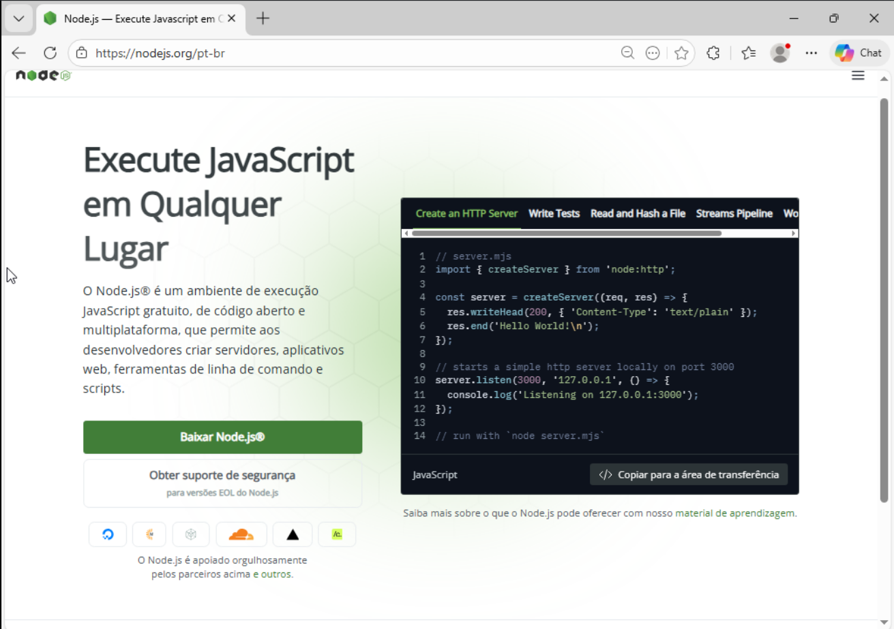
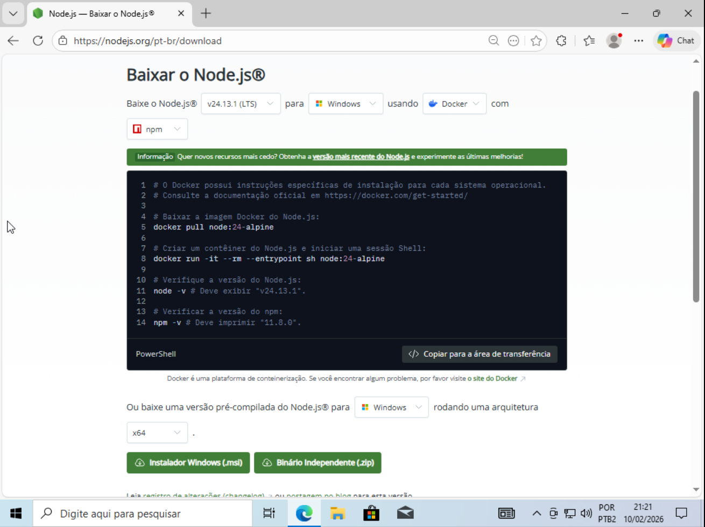
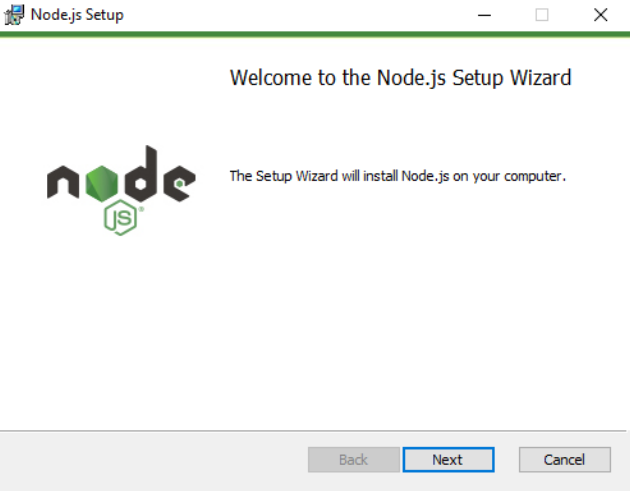
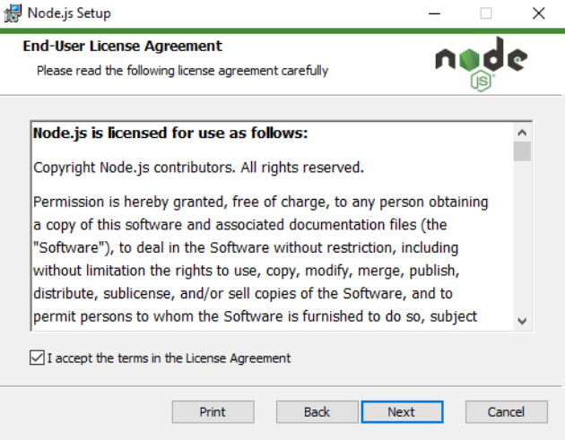
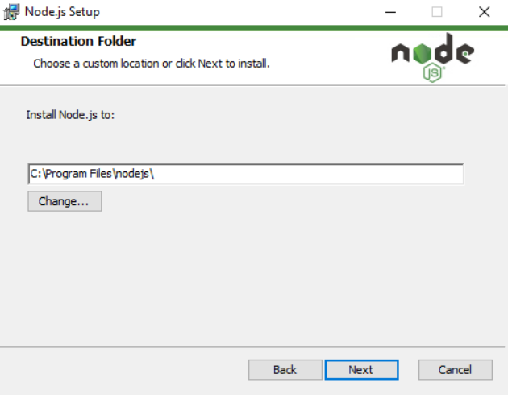
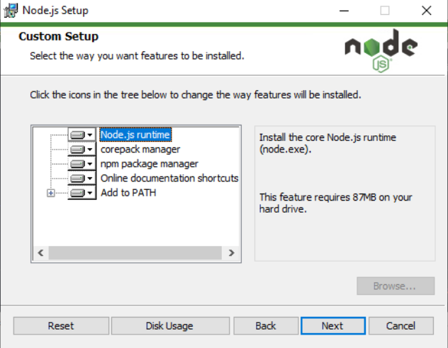
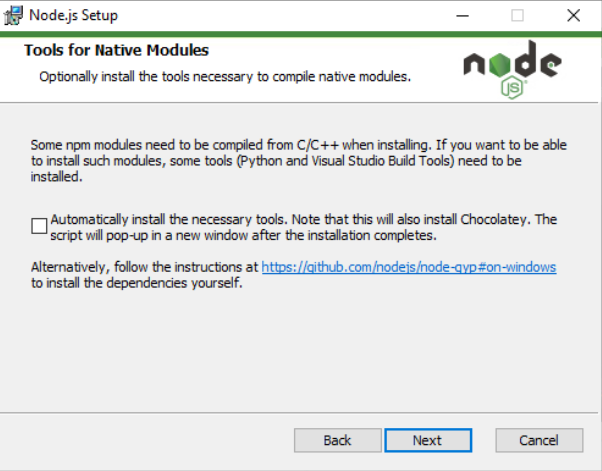
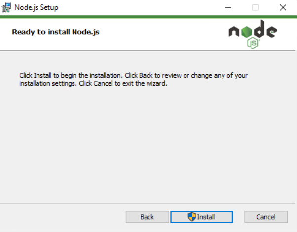
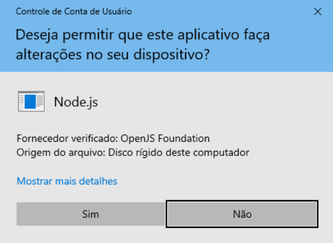
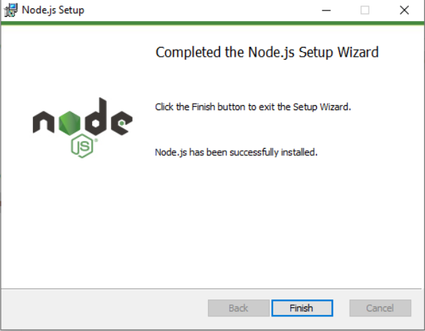

# AULA 01 - Conhecendo o Javascript e Node.js
Javascript é uma linguagem de programação que sempre fica nos topos dos ranking de linguagem mais usadas por conta de sua simplicidade e ser usada em diversos cenários.

Inicialmente ela era para criar site com interações dinâmicas e responsivas. Atualmente é usado em quase tudo!

Javascript originalmente é usado no navegador, podendo o usuário do Chrome executar comandos no terminal do navegador.

Hoje veremos o Node.js, umas das ferramentas para criação de servidores backend.

Durante o curso, mostraremos na prática como a linguagem funciona.

Afinal, o que é o backend?

Bem, o backend seria, simplificando demais, a conexão de uma aplicação (um site, um aplicativo, software etc.) à um banco de dados. É aqui que a mágica acontece! Pois você só consegue logar em um site por conta do backend, fazer aquela sua compra suspeita na Shoope etc.

## Node.js
O Node.js é um ambiente de execução do Javascript no lado do servidor (neste caso, seu computador), sem precisar de um navegador. Ou seja, é possível testar seus comandos sem uma página web e, além disso, poder criar um servidor que grava e devolve informações de um banco de dados.

### Instalação e configuração do Node.js
Todas as instruções está no site do Node.js (https://nodejs.org/).
#### Windows
##### Binário
É bem simples, baixando o .msi, é praticamente apertando apenas o next (próximo) para instalar.
- **Entrar no página do NodeJS e clicando no Baixar Node.js**

- **Tela de instalação, clicar no botão de Instalador Windows(.msl)**

- **Tela de Bem-Vindo**(praticamente, daqui em diante é clicar em next)

- **Tela dos termos, só clicar em aceitar os termos**

- **Tela para escolher onde vai ser instalado o Node.js**

- **Tela de instalação de outras ferramentas, apenas clicar em next para o básico**

- **Tela do instalação do Chocolatey, não vai ser necessário**

- **Tela dos instalação, clicar em instalação**

- **Clicar em sim**

- **Finalização**


#### Linux
Tem duas maneiras de instalar no linux: por terminal e por arquivo binário.
##### Pelo terminal
Acessando o terminal, execute os comandos:

- **Baixar e instalar o nvm (Node Version Manager):**
    ```bash
    curl -o- https://raw.githubusercontent.com/nvm-sh/nvm/v0.40.3/install.sh | bash 
    ```

- **Em vez de reiniciar o terminal, carrega o script do nvm no shell atual:**
    ```bash
    \. "$HOME/.nvm/nvm.sh"
    ```

- **Baixar e instalar a versão 24 do Node.js:**
    ```bash
    nvm install 24
    ```

- **Verificar a versão instalada do Node.js:**
    ```bash
    node -v # Deverá imprimir "v24.13.0".
    ```

- **Verificar a versão instalada do npm (gerenciador de pacotes):**
    ```bash
    npm -v # Deverá imprimir "11.6.2".
    ```

##### Pelo binário
- **Baixe o binário**
- **Extrair os arquivos**
    ```bash
    tar -xf node-vX.Y.Z-linux-x64.tar.xz
    ```
    > Substitua vX.Y.Z e linux-x64 pela versão/arquitetura que você baixou. (a versão deste momento é a node-v24.13.1-linux-x64.tar.xz)
- **(OPCIONAL) Mover para a pasta de instalação global**
    ```bash
    sudo mv node-vX.Y.Z-linux-x64 /usr/local/nodejs
    ```
    > /usr/local/nodejs é a pasta de instalação global

- **Atualizar o PATH**
    ```bash
    # exemplo para Bash ou Zsh
    echo 'export PATH=/usr/local/nodejs/bin:$PATH' >> ~/.bashrc
    # então recarregue o profile
    source ~/.bashrc
    ```

- **Verificar se está instalado**
    ```bash
    node -v
    npm -v
    ```