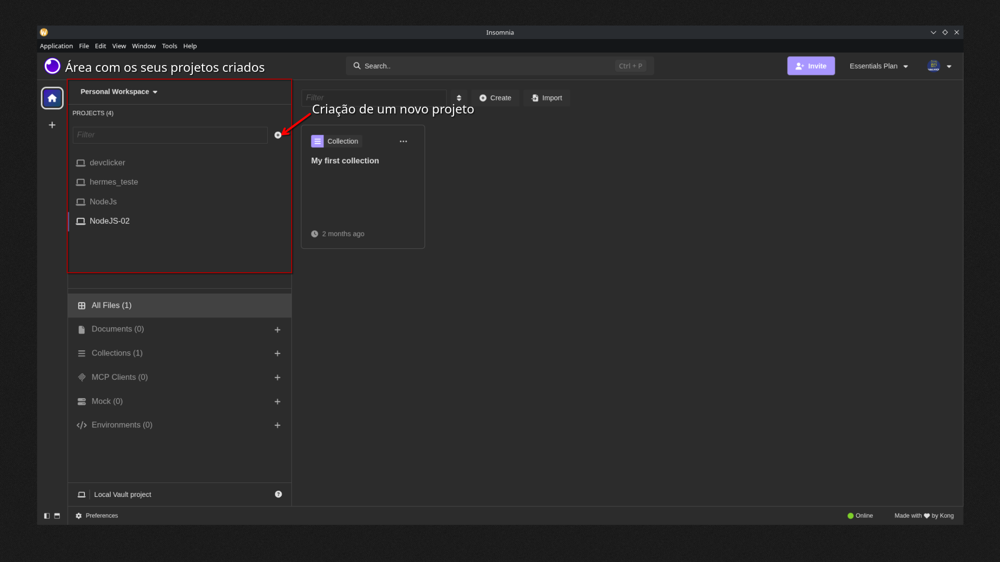
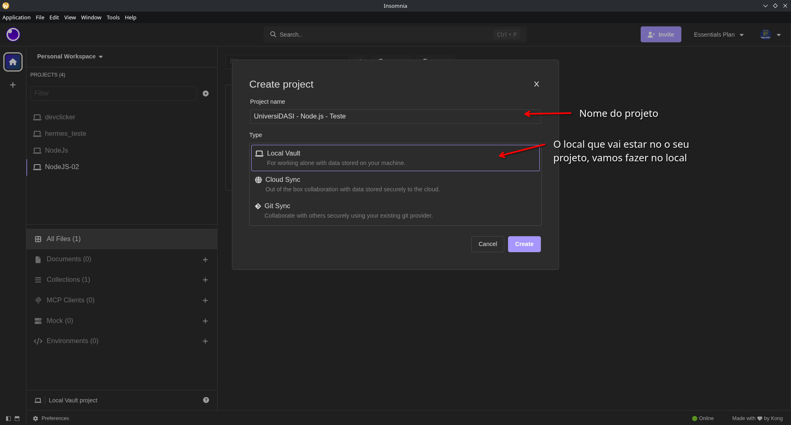
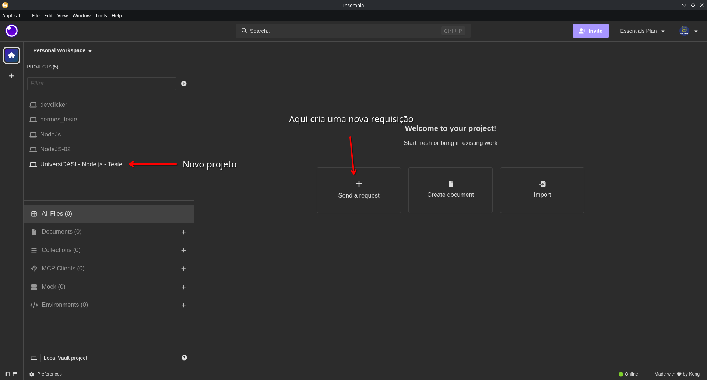
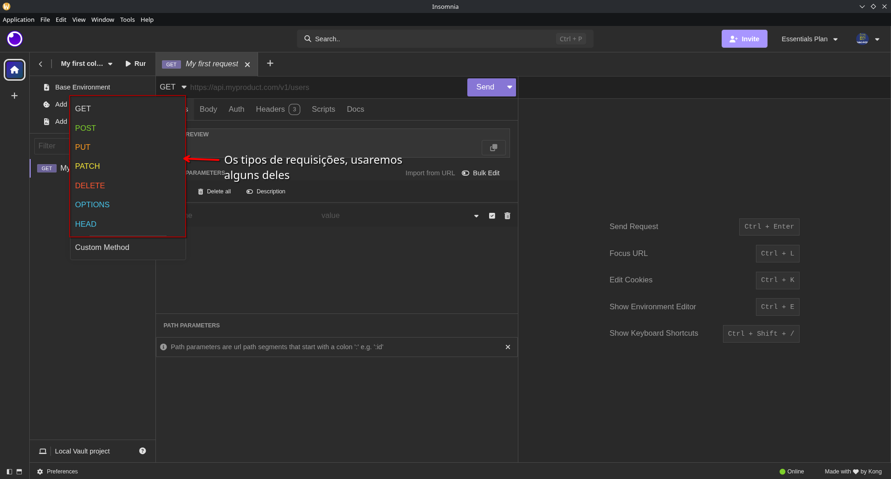

## INSOMNIA
O Insomnia é uma ferramenta muito útil para testar as rotas que você escreveu! Vamos para instalação dele:
### Linux
Para o nosso maravilhoso Linux, há diversos métodos de baixar o Insomnia, iremos mostrar três deles:
#### Snap
O Snap é uma forma de empacotar apps que funciona em muitas distribuições (Ubuntu, Debian, Fedora, Manjaro, Arch etc.).
1. Instale o Snap caso ainda não tenha:
    ``` bash
    sudo apt update
    sudo apt install snapd
    # Use o instalador de seu Linux, aqui funciona em diversas
    # distros baseados em Derbian
    ```
2. Instale o Insomnia
    ```bash
    sudo snap install insomnia
    ```
    - Agora é possível acessar o Insomnia no Menu ou no terminal digitando `insomnia`

#### Flatpak
Flatpak é outra forma universal de empacotar apps no Linux, funciona bem em Ubuntu, Fedora, openSUSE, Debian, Arch, etc.
1. Instale o flatpak caso ainda não tenha instalado:
    ```bash
    sudo apt update
    sudo apt install flatpak
    # Atente ao instalador da sua distro
    ```
2. Adicione o repositório do Flathub:
    ```bash
    flatpak remote-add --if-not-exists flathub https://flathub.org/repo/flathub.flatpakrepo
    ```
3. Insale o Insomnia;
    ```bash
    flatpak install flathub rest.insomnia.Insomnia
    ```
    - Agora pode acessar o Insomnia no Menu ou pelo terminal através do comando: `flatpak run rest.insomnia.Insomnia`

#### AppImage
Um arquivo que tem a imagem do aplicativo. 
1. Baixar o .AppImage, caso tenha opção:
2. Tornar ele executável. Vai até onde o arquivo foi baixado e rode o seguinte comando:
    ```bash
    chmod +x Insomnia*.AppImage
    ```
    - Agora já é possível usar o aplicativo usando o comando no terminal na pasta do .AppImage: `./Insomnia*.AppImage`.
3. Mover para uma pasta fixa. Pode ser qualquer pasta, mas aqui vai um exemplo:
    ```bash
    mkdir -p ~/.local/bin
    mv ~/Downloads/Insomnia*.AppImage ~/.local/bin/
    ```
    - No `~/.local/bin`, que está no `PATH` do Linux, é possível executar o aplicativo, pode-se chamar no terminal: `Insomnia*.AppImage`
4. Renomear o arquivo para encurtar o comando:
    ```bash
    mv ~/.local/bin/Insomnia*.AppImage ~/.local/bin/insomnia
    ```
    - Agora é possível executar o `insomnia` para abrir o aplicativo.
5. Criar um atalho no Menu
    - Abrir o editor de texto usando:
    ```bash
    nano ~/.local/share/applications/insomnia.desktop
    ```
    - Cole o conteúdo, trocando o `SEU_USUARIO` pelo seu usuário do linux:
    ```ini
    [Desktop Entry]
    # Nome do aplicativo no menu
    Name=Insomnia
    # O comando que vai ser executado quando clicado
    Exec=/home/SEU_USUARIO/.local/bin/insomnia
    # O seu Icone
    Icon=/home/SEU_USUARIO/.local/bin/insomnia
    # Define o tipo da entrada.
    Type=Application
    # Qual é a categoria do aplicativo
    Categories=Development;
    ```
    - Salve o arquivo e feche;
    - Atualize o menu:
    ```bash
    update-desktop-database ~/.local/share/applications
    ```

### Windows
No Windows, é só baixar e executar o arquivo e pronto 😃.

Agoras vamos entender o básico de como funciona o aplicativo.

### Usando o Insomnia
1. Tela inicial, temos onde está os projetos:

2. Tela de criação do projeto:

3. Criar uma requisição para o projeto:

4. Parâmetro, Body e Query

5. Apresentação das requisições


Durante o curso, vamos usar bastante para não ter que criar um frontend para testar a nossa aplicação.