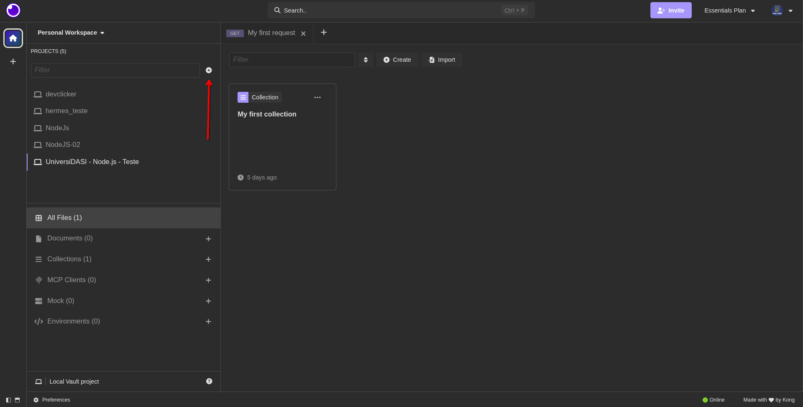
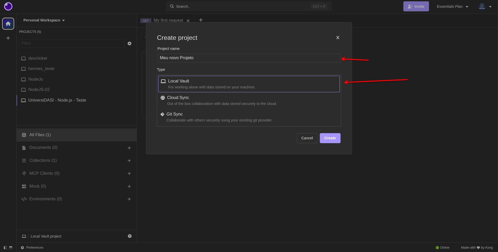
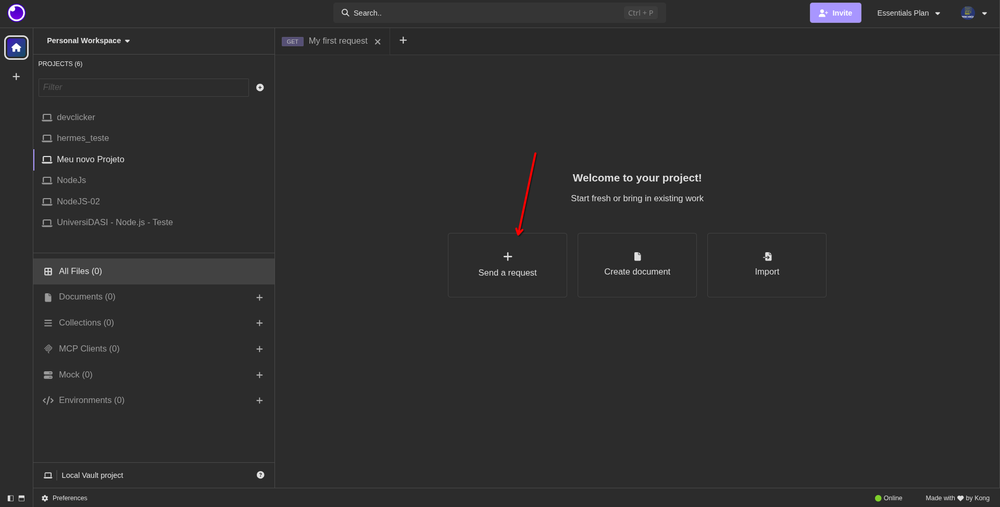
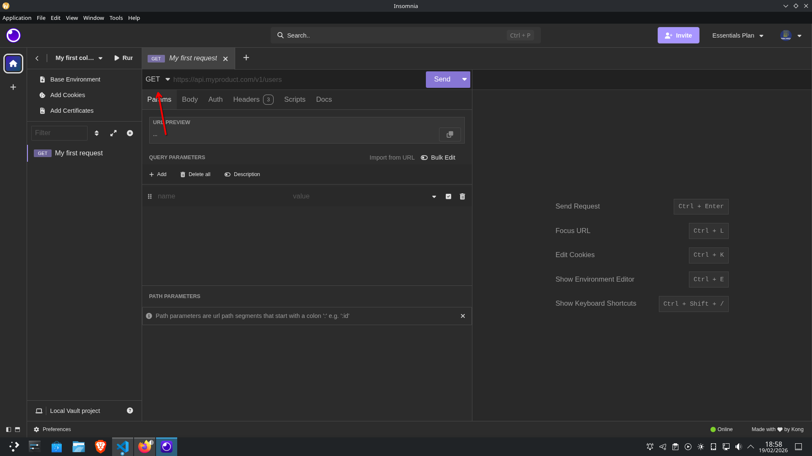
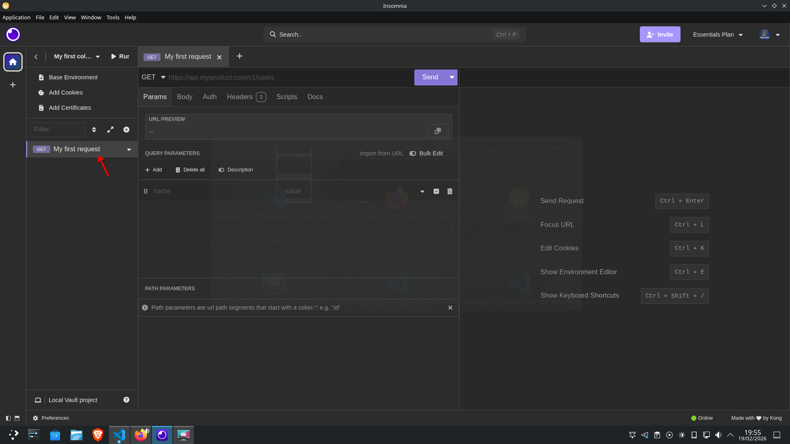
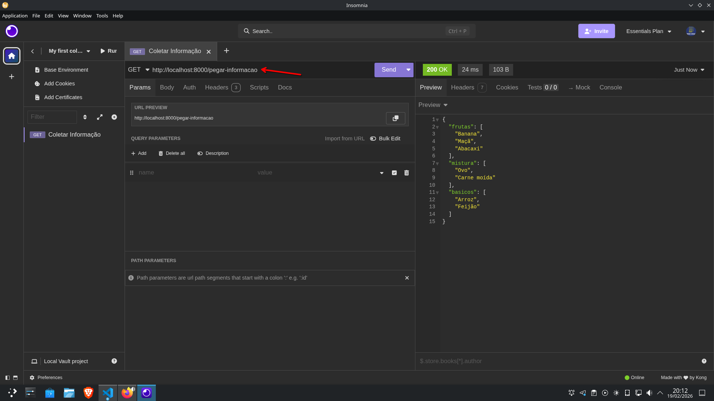
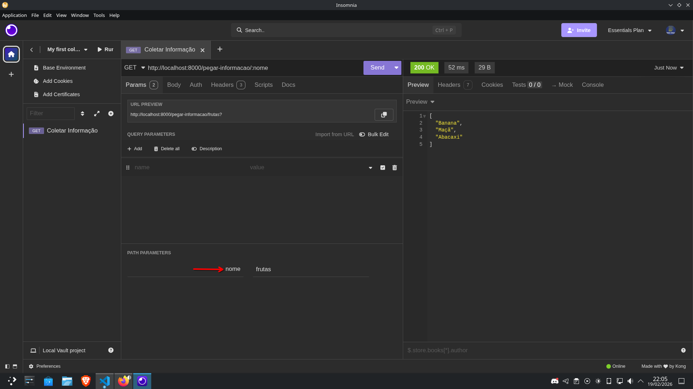
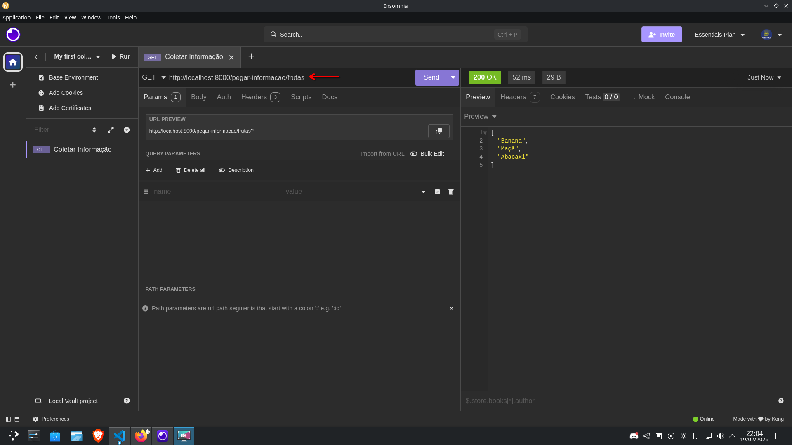
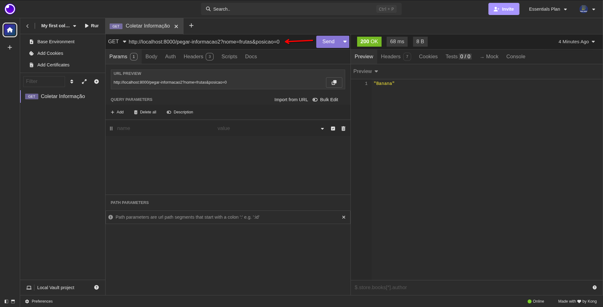

## CRUD
CRUD?? O que é isso?
É uma sigla que significa Create, Read, Update e Delete, ou seja, é as operações de manipulações da informação em uma aplicação. São as operações básicas de uma aplicação.

Como podemos fazer isso usando Node.js? Vamos Começar!

### Configurações
1. Rodar o `npm init -y` e a única coisa que vamos modificar do arquivo criado é o `type` para `module`;
2. Instalar o `express`, que vai ser a biblioteca que vamos usar para o desenvolvimento do backend. Com ele que vamos criar as rotas principais e outras coisa de back (hehe). Usa-se `npm i express`.

### Começando o trabalho!
Na pasta onde está o `package.json`, cria o arquivo com o nome do campo `main` do arquivo `.json`. Daí, vamos importar o `express` e colocar ele em uma constante.
```javascript
// index.js => arquivo que foi criado e o nome está escrito no main
import express from "express";

const app = express(); // Aqui é "criamos" um servidor, mas ele não estar rodando ainda

app.listen(8000);// Aqui estamos indicando que ele ousa a porta 8000 local, ou seja, aqui que vai entrar os chamados!
```

Tá, ele está ouvindo agora... mas e aí? O que vem em seguida?? Bem, tudo entre a criação do servidor e a porta estar ouvindo, podemos criar rotas que toda a vez que forem chamar essas rotas, o servidor vai ouvir e executar o que tiver nela.

A partir daqui, vamos começar à montar nosso CRUD. Vamos usar como exemplo, uma lista já fiz para nossa aplicação, que ainda vai funcionar sem problemas! Mas normalmente é feita uma conexão com um banco de dados e executado os devidos comandos!

### GET
O `GET` é a rota mais básica de todas! Como o nome já diz, ela é voltada para pegar alguma informação e retornar para a aplicação. O `GET` mais simples é o que pega todas as informações.
```javascript
// index.js
import express from "express";

// Lista de um mercado
const mercado = {
    frutas: ["Banana", "Maçã", "Abacaxi"],
    mistura: ["Ovo", "Carne moída"],
    basicos: ["Arroz", "Feijão"]
}

const app = express();
app.use(express.json()); // Aqui vai permitir enviar um objeto como resposta ({objeto: "isto é um objetos"})

app.get("/pegar-informacao", (req, res) => {
    // Aqui estamos criando uma rota que vai ouvir uma requesição HTTP/GET do caminho "/pegar-informacao"
    // Ou seja, toda vez que o site chamar essa rota, ele vai executar a função que ela comporta.
    // o nome da rota ("/pegar-informacao") não pode ter espaços e acentos, exceto o hífen e o underline, sempre 
    // começando com uma barra no começo.
    // Uma mesma rota pode ter diversos métodos.
    // o (req, res) => {} é a dita função que é obrigada receber os dois parâmetros, sendo um a requisição ("req") que tem 
    // todas as informações da requisão; e a resposta ("res") que é obrigada a ser devolvida de alguma forma para o cliente 
    // (caso não devolva o "res", o servidor espera infinitamente pela resposta)
    // aqui pode ser executado qualquer coisa, mas a rota GET é usada para pegar informações de uma base de dados
    // Aqui vai um exemplo
    return res.json(mercado); // aqui vai retornar um objeto JSON como resposta
});

app.listen(8000);
```
Bem, acima é um básico, agora vamos explicar melhor.

O `.get` acaba por indicar uma rota de GET, ou seja, pegar informações de uma base dados, no caso, nosso objeto. Aqui vamos ter o `req` e o `res`, algo que vai repetir nos outro métodos. Como falado acima, o `req` é a requisição e o `res` é a respota, que o primeiro é obrigado "chegar" e o segundo a "sair".

#### Requisição HTTP (req)

O `req` tem umas propriedades interessantes:
- `req.params` => pega os parâmetros passado pela rota;
- `req.query` => pega as querys, que são outra forma de parâmetros, de forma curta e grossa;
- `req.header` => o cabeçalho da requisição;
- `req.body` => o corpo, aqui pode ter dados necessário para um cadastro, por exemplo;
- `req.method` => qual é o método da requisição;
- `req.URL` => o caminho no navegador para a requisição.

Aqui temos os seguintes elementos da requisição:
- **Request Line:** Onde é identificado o método, o caminho e a verrsão do HTTP: `MÉTODO caminho VERSÃO-DO-HTTP`, o exemplo mais simples é o método GET: `GET /usuario HTTP/1.1`;
- **Headers:** os metadados da requisição, uma "configuração" da requisição. Aqui há alguns headers importantes:
    - *Host*: onde o servidor é hospedado;
    - *User-Agent*: quem está fazendo a requisição, com o nome do navegador, sua versão e o sistema operacional, dentre outras informações;
    - *Authorization*: usado para autenticar os usuários;
    - *Cookie*: envio dos cookies;
    - *Accept*: tipo de respostas aceitas, como json (`application/json`) ou html (`text/html`);
    - *Content-Length*: tamanho em bytes que o corpo pode ter.
- **Body**: informações enviadas para o servidor, normalmente usado em POST, PATCH, PUT, dentre outros. Ele pode ser de diversos tipos, como json e html.

Exemplo de uma requisição HTTP:
```http
POST /usuarios HTTP/1.1
Host: localhost:8000
Content-Type: application/json
Content-Length: 48

{"nome":"Dasi","email":"admin@dasi.com"}
```

Um fato curiosos é caso acesse o "http://localhost:8000/pegar-informacao" (que será explicado mais para frente), sempre vai retornar um método GET.

#### Resposta HTTP (res)

Enquanto ao `res`, ela é a própria resposta que é obrigada a ser enviada. Essa resposta é composta por:
- **Versão e Status**: toda a resposta tem uma versão do HTTP e um status. A versão pode ser a 1.1 ou 2, enquanto o `status` pode variar, mas seu padrão é `200`, que indica sucesso. É chamado de **Status Line** (Linha de Status) e é representada como:
`HTTP/versão código mensagem-do-código`; usando como exemplo o `200`: `HTTP/1.1 200 OK`.
Aqui vão alguns código que a resposta pode enviar:
    - `200` => sucesso;
    - `201` => criado;
    - `400` => requisição inválida;
    - `401` => não autorizado;
    - `404` => não encontrado;
    - `500` => algum erro interno no servidor.

- **Headers:** O cabeçalho, que pode ter vários elementos:
    - *Content-Type*: qual o tipo do conteúdo do `body`, como `json` (`application/json`) ou html (`text/html`), por exemplo;
    - *Content-Length*: o tamanho, em bytes, que o `body` pode ter;
    - *Set-Cookie*: quando o backend configura os cookies do site;
    - *Cache-Control*: controle de cache do navegador.

- **Body**: o conteúdo que pode ser enviado como resposta, podendo ser um json ou um html, por exemplo:
    ```json
    {
        "id":"identificador",
        "nome": "Hermes"
    }
    ```
    ou
    ```html
    <h1> Texto <h2>
    ```
Uma coisa importante: nem todas as repostas tem corpo, como as de status 204 e 304 (esta última ainad pode ter o body, mas não é obrigatório).

Exemplo de uma resposta HTTP:
```HTTP
HTTP/1.1 200 OK
Content-Type: application/json
Content-Length: 27

{"mensagem":"Sucesso"}
```

Terminando, o `res` tem três métodos principais que é de extrema importância para o desenvolvimento:
- **res.send()**: ele envia uma resposta com um tipo genérico, podendo ser qualquer tipo, entre eles: JSON, String, Object, Boolean, Array, dentre outros! Ele já configura automaticamente o header para aceitar o tipo definido;
- **res.json()**: aqui ele obriga o servidor enviar um JSON como resposta;
- **res.status()**: manda qual foi o status da operação, sendo o padrão o 200.
(É possível interpolar `status` com os outros dois: `res.status(200).json({response: "Sucess"});`)

\
Uffa, muita informação né! Mas onde nós estavamos?? Ah é! O método GET hehe!

Vamos voltar para o nosso exemplinho lá em cima:

```javascript
// index.js
import express from "express";

// Lista de um mercado
const mercado = {
    frutas: ["Banana", "Maçã", "Abacaxi"],
    mistura: ["Ovo", "Carne moída"],
    basicos: ["Arroz", "Feijão"]
}

const app = express();
app.use(express.json()); // Aqui vai permitir enviar um objeto JSON como resposta ({objeto: "isto é um objeto"})

app.get("/pegar-informacao", (req, res) => {
    return res.json(mercado);
});

app.listen(8000);
```

Aqui é apenas uma rota que devolve todos os dados do nosso objeto.

Mas como sabemos que está dando certo? Primeira, temos que botar esse servidor para rodar! Vá no terminal e na pasta que está nosso index.js, rodamos `node index.js`, apartir daí ele vai ouvir a porta 8000.
Vamos agora para o Insomnia, nele vamos fazer nossos testes!
Na tela inicial, vamos criar um projeto no Local Vault!



Agora vamos fazer nossa primeira requisição!


Na tela das requisições, é possível criar novos requisições, renomea-las e testar o seu servidor.
seta indica onde mudar o tipo de requisição que vai se realizar.


Nessa outra seta, clicando das vezes ou com o botão direito e renomear (rename), é possível trocar o nome do requisição, para facilitar a identificação.


Agora vamos Começar os trabalho! Vamos renomear a requisição para "Coletar Informação".
Do lado do GET na parte de cima, vamos escrever:
`http://localhost:8000/pegar-informacao`, isso aqui indica que a nossa requisição é um protocolo HTTP, num servidor local (`locahost`) ouvindo na porta 8000, acessando o recurso `/pegar-informacao`.

Então, lembra o `node index.js`, ele está fazendo rodar esse servidor no `localhost`.


A seta indica nossa "URL", e a direita é nossa resposta pelo `res.json()`. E assim que testamos nosso back!

Agora vamos partir para outros elementos que os métodos podem ter!

### Params e Querys
#### Params
São os parâmetros passado na URL. Ele é normalmente usado para identificar recursos específicos, mas pode ser usado para realizar pesquisas também, entre outras coidas.

Ele é indicado por `/:nome-parametro` no caminho da rota. Vamos para um exemplo: vamos pesquisar as frutas no nosso objeto.
```javascript
// index.js
import express from "express";

// Lista de um mercado
const mercado = {
    frutas: ["Banana", "Maçã", "Abacaxi"],
    mistura: ["Ovo", "Carne moída"],
    basicos: ["Arroz", "Feijão"]
}

const app = express();
app.use(express.json()); // Aqui vai permitir enviar um objeto JSON como resposta ({objeto: "isto é um objeto"})

app.get("/pegar-informacao", (req, res) => {
    return res.json(mercado);
});
app.get("/pegar-informacao/:nome", (req, res) => {
    // para podemos puxar os parâmetros, usa o req.
    // params, aí devolve um objeto desses parâmetros 
    // com seus valoes. Para puxar um específico, usa-se
    // req.params.nome
    const campo = req.params.nome;
    return res.json(mercado[campo]);
});

app.listen(8000);
```

Abaixo pode ver o resultado:

Colocando a URL igual o caminho, o Insomnia permite inicializar o valor na seta, maaas é possível escrever direto na URL:


#### Query
A query seria outra forma de passar parâmetros na URL, usado para pesquisas, filtros, ordenação, etc. Ele não vai no caminho dá rota, mas é escrito na URL quando é feito a requisição. Por exemplos, vamos pegar o primeiro item da "mistura" no objeto "mercado", para isso, durante a requisição precisa-se ter uma URL parecido com isso: `http://localhost:8000/pegar-informacao?nome=frutas&posicao=0`. A query é separado do recurso pelo `?`, em que cara parâmetro dela é composto por `nome` e um `valor` (`name=value`), e cada parâmetro é separado por um `&` ("e" comercial).

Exemplo:
```javascript
// index.js
import express from "express";

// Lista de um mercado
const mercado = {
    frutas: ["Banana", "Maçã", "Abacaxi"],
    mistura: ["Ovo", "Carne moída"],
    basicos: ["Arroz", "Feijão"]
}

const app = express();
app.use(express.json()); // Aqui vai permitir enviar um objeto JSON como resposta ({objeto: "isto é um objeto"})

app.get("/pegar-informacao", (req, res) => {
    return res.json(mercado);
});

app.get("/pegar-informacao/:nome", (req, res) => {
    const campo = req.params.nome;
    return res.json(mercado[campo]);
});

app.get("/pegar-informacao2", (req, res) => {
    // mudamos o caminho para não dar conflito com o de 
    // cima
    console.log();
    const posicao = Number(req.query?.posicao);
    const nome = req.query?.nome;
    return res.json(mercado[nome][posicao]);
});

app.listen(8000);
```

Abaixo se vê o resultado:

A seta estaria apontando para nossa URL atual com a query, enquanto a esquerda mostra o resultado.

Agora você sabe como pegar informações, tanto com filtro quanto sem.

Para não ficar muito extenso, nos próximos arquivos será o restante do CRUD.