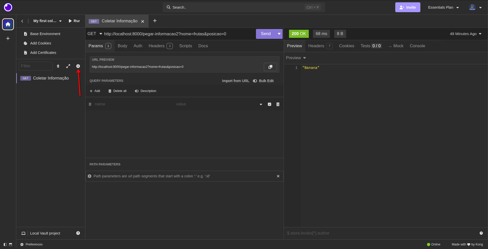
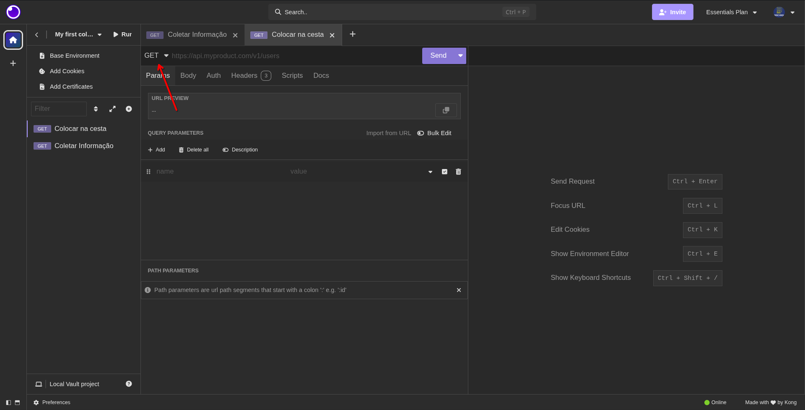
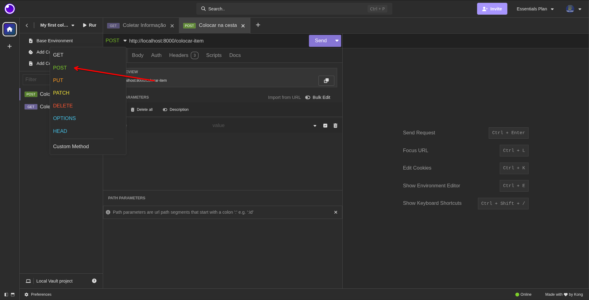
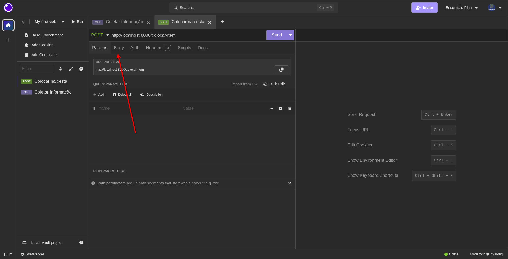
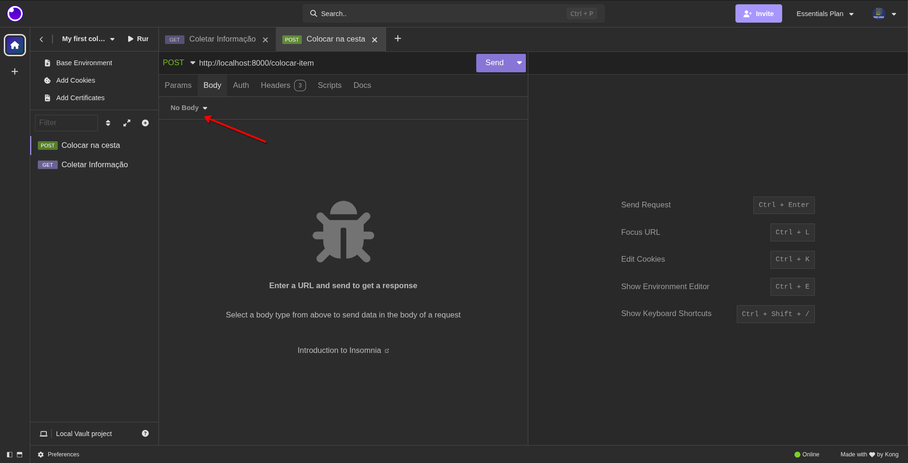
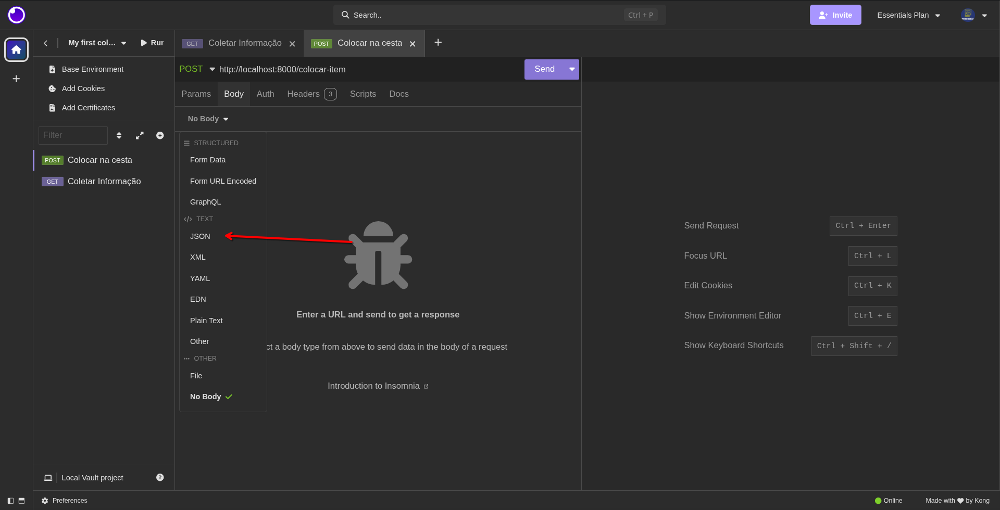
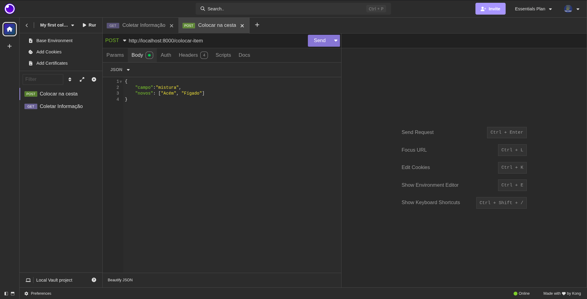
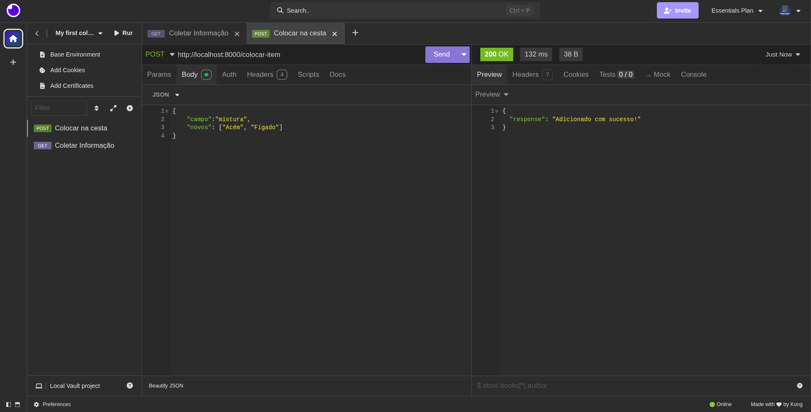
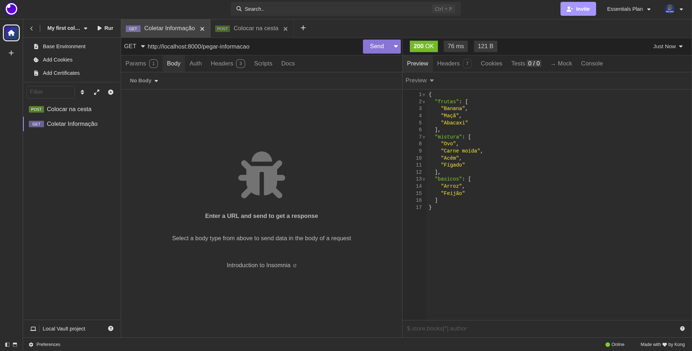

### Post
Aqui que vamos começar a modificar os dados da nossa base de dado. Você se lembra do body? Vamos o usar bastante aqui por diante!

Pense na situação: vou adicionar mais item à minha cesta do mercado, como posso fazer isso? Lógico, somos maníaco por organização, deixo minhas frutas separadas das outras coisas, assim como a mistura e o básico.

Bem, o corpo pode ser qualquer coisa! Aqui vamos usar o formato JSON para receber as informações, pois é um padrão no mercado!

Duranta uma requisição POST, recebemos o seguinte JSON:
```json
{
    "campo":"mistura",
    "novos": ["Acém", "Fígado"]
}
```

A partir daí, começamos o POST:
```javascript
import express from "express";

// Lista de um mercado
const mercado = {
    frutas: ["Banana", "Maçã", "Abacaxi"],
    mistura: ["Ovo", "Carne moída"],
    basicos: ["Arroz", "Feijão"]
}

const app = express();
app.use(express.json()); // Aqui vai permitir enviar um objeto JSON como resposta ({objeto: "isto é um objeto"})

//GET's
//...

app.post("/colocar-item", (req, res) => {
    // Aqui pegamos todos os elementos do body
    const body = req.body;
    // O try vai tentar algo, se der erro, ele vai para o
    // catch e resolve lá
    try {
        const campo = body.campo;
        const values = body.novos;
        mercado[campo].push(...values);

        return res.status(200).json({response: "Adicionado com sucesso!"})
    } catch (err) {
        return res.status(500).json({error: err});
    }
});

app.listen(8000);
```
Indo para o Insominia, vamos cria mais uma requisição para o POST.

Agora é renomear para um nome melhor e depois trocar o GET para o POST:



Agora não é só clicar em send, pois ainda não temos o body!

Indo na opção Body (Corpo, em português), não vamos ter nada, mas clicando em `No Body` podemos ver que há diversas tipos de Body, vamos ir em JSON.




Agora adicionamos o JSON:
```json
{
    "campo":"mistura",
    "novos": ["Acém", "Fígado"]
}
```


Daí agora só clicar em send e pronto!


Podemos verificar novamente usando GET.


### PATCH
Agora vamos usar o PATCH para atualizar nossa listinha. Aqui vamos usar o conceito dos parâmetros na url e do body. Vamos nessa!

Vamos agora criar uma nova requisição, renomea-la e mudar de GET para PATCH.

Aqui, como **exemplo**, vamos usar uma a seguinte URL: `http://localhost:8000/atualizar-lista/:campo`, que o campo será `frutas`. Aqui, vamos receber do usuário o JSON: 
```json
{
    "item_antigo": "Banana",
    "item_novo": "Manga"
}
```

Bem, agora vamos para o código:
```js
import express from "express";

// Lista de um mercado
const mercado = {
    frutas: ["Banana", "Maçã", "Abacaxi"],
    mistura: ["Ovo", "Carne moída"],
    basicos: ["Arroz", "Feijão"]
}

const app = express();
app.use(express.json()); // Aqui vai permitir enviar um objeto JSON como resposta ({objeto: "isto é um objeto"})

//GET's
//...

//POST
//...

app.patch("/atualizar-lista/:campo", (req, res) => {
    try{
        const campo = req.params.campo;
        const {item_antigo, item_novo} = req.body;
        const pos = mercado[campo].findIndex(item_antigo);

        if(!pos) return res.status(404).json({error: "Item não encontrado"});

        mercado[campo][pos] = item_novo;

        return res.status(200).json({message: "Atualizado!"});
    } catch (err) {
        
        return res.status(500).json({message: "Erro inesperado"});
    } 
});

app.listen(8000);
```

Enviando esse body e não dar nenhum erro, só conferir no GET.