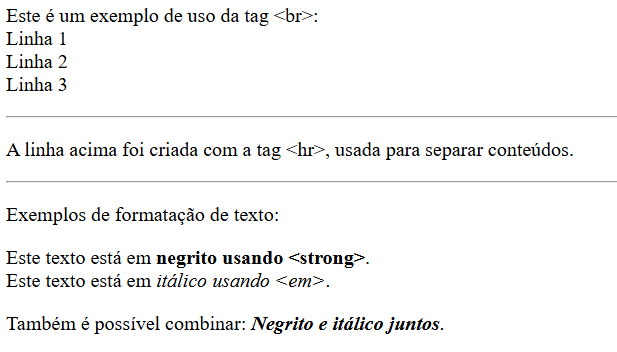
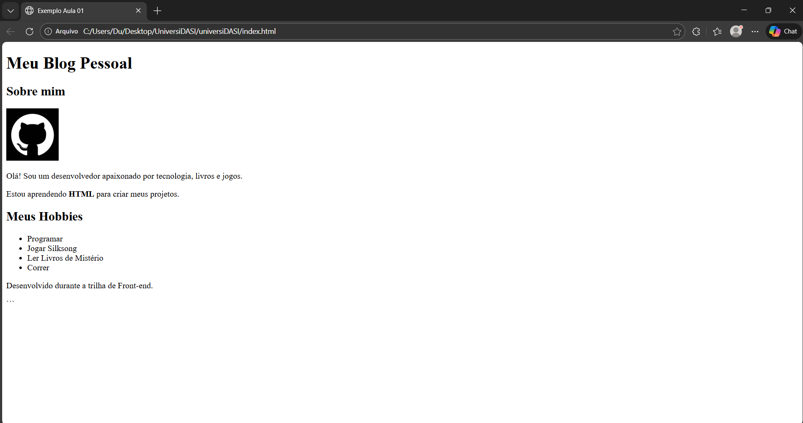

# Aula 01 - HTML, O Esqueleto da Web

## 1. O que é o HTML?

Usando aquela boa e velha analogia: se um site fosse uma casa, o HTML (**H**yper**T**ext **M**arkup **L**anguage) seria a fundação, as vigas e as paredes de tijolo. Ele não é responsável pela pintura (isso é com o nosso amigo CSS) nem por acender as luzes automaticamente (isso é com o nosso camarada JavaScript). O HTML serve puramente para dar **estrutura** e **significado** ao conteúdo.

Ele funciona através de **tags** (etiquetas). Você "etiqueta" um conteúdo para dizer ao navegador o que aquilo é.

**Exemplo:**

- Isto é um parágrafo: `<p>Olá, mundo</p>`
    
- Isto é um título: `<h1>Meu Site</h1>`

### 1.1 Decifrando a Sigla 

Para entender de verdade, vamos quebrar a sigla:

- **Hypertext (Hipertexto):** Significa que o texto não é linear (como um livro). Ele tem **links** (hiperlinks) que conectam uma página a outra. É isso que cria a "Teia" (Web).
    
- **Markup (Marcação):** Nós não "programamos" lógica (cálculos) em HTML. Nós **marcamos** o conteúdo. Você pega um texto solto e marca: _"Isto é um título"_, _"Isto é um botão"_.
    
- **Language (Linguagem):** É a língua padrão que todo navegador do mundo entende.
    

### 1.2 O Papel do Navegador (O "Tradutor")

Você escreve, por exemplo, o código no **VS Code** (que é apenas um editor de texto), mas quem faz a mágica acontecer é o **Navegador** (Chrome, Firefox, Edge).

1. O Navegador recebe seu arquivo `.html`.
    
2. Ele lê as etiquetas (tags) de cima para baixo.
    
3. Ele **renderiza** (desenha) os elementos na tela conforme as instruções.
    

> **Importante:** O HTML é uma linguagem que "perdoa" erros. Se você esquecer de fechar uma tag, o navegador vai **tentar** adivinhar o que você queria fazer. Isso parece bom na teoria, mas na prática pode ser perigoso! O site pode funcionar no seu computador e quebrar no do vizinho, por exemplo. Por isso, tentaremos escrever o código certinho desde o começo.

### Dica de Produtividade Gigatônica para quem usa VS Code

Se você está usando o VS Code, não precisa digitar tudo manualmente.

1. Crie um arquivo `.html`.
    
2. Digite apenas um ponto de exclamação `!` e aperte **Enter**.
    
3. O editor cria toda a estrutura básica automaticamente para você!

Exemplo de como fica após realizar o macete acima digitando ! e apertando Enter em seguida:

``` HTML
<!DOCTYPE html>

<html lang="en">

<head>

    <meta charset="UTF-8">

    <meta name="viewport" content="width=device-width, initial-scale=1.0">

    <title>Document</title>

</head>

<body>

</body>

</html>
```

---

## 2. Anatomia de uma Tag (Entendendo os Atributos)

Você verá muito código assim: `<a href="https://google.com">`. O que é esse texto dentro da tag? Chamamos de **Atributos**. Eles funcionam como configurações ou "adjetivos" da tag e sempre vão na tag de _abertura_.

- A tag `<a>` diz: "Isto é um link".
    
- O atributo `href="..."` diz: "Para este lugar que o link leva".
    
- Sem o atributo, a tag fica incompleta ou não funciona como deveria.
    
### 2.1 A Regra do Fechamento: Pares vs. Solitárias

Uma das maiores dúvidas no começo é: _"Quando eu preciso colocar o `/` para fechar a tag?"_ A regra é simples: Depende se a tag tem **conteúdo dentro** ou não.

**1. Tags Pares** A maioria das tags serve para envolver algo. Elas precisam dizer onde o efeito começa e onde ele termina.

- Pense na tag `<a>`. Ela cria um link. Mas _o que_ é o link? É o texto "Clique Aqui".
    
- Então você precisa abrir antes do texto e fechar depois dele.
    
    - **Correto:** `<a>Clique aqui</a>` (O texto está "abraçado").
        
    - **Errado:** `<a href="...">` (O navegador não sabe onde o link termina, e pode transformar o resto do seu site inteiro em um link!).
        
- _Outros exemplos:_ `<p>Texto</p>`, `<h1>Título</h1>`, `<ul>Lista</ul>`.
    

**2. Tags Solitárias (Void Elements)** Algumas tags não guardam nada dentro delas. Elas **são** o próprio elemento.

- Pense na tag ``. Ela é a foto. Você não escreve nada "dentro" da foto. Você apenas diz onde ela está.
    
- Por isso, ela não tem fechamento. Ela se resolve nela mesma.
    
    - **Correto:** ``
        
- _Outros exemplos:_ `<br>` (quebra de linha), `<hr>` (linha horizontal), `<input>` (campo de texto).
    

---

## 3. A Estrutura Básica

Todo arquivo HTML segue um padrão obrigatório. Pense nela como o corpo humano. Mas, além das partes principais, temos algumas "configurações de fábrica" essenciais.

Vamos analisar linha a linha o código que o VS Code gera:


``` HTML
<!DOCTYPE html>
<html lang="pt-BR"> <head>
    <meta charset="UTF-8"> <meta name="viewport" content="width=device-width, initial-scale=1.0"> <title>Meu Site</title>
</head>
<body>
    </body>
</html>
```

### 3.1 Entendendo o `<head>` 

O `<head>` guarda informações que o usuário **não vê** na tela, mas que são vitais para o site funcionar.

- **`meta charset="UTF-8"`**: Essa é a linha mágica da acentuação.
    
    - Sem ela, o navegador pode não entender caracteres como `ç`, `ã` ou emojis. Ou seja, por exemplo, se você tirar essa linha, a palavra "Ação" pode virar "Ação".
        
- **`meta name="viewport"`**: Essa é a linha do celular.
    
    - Ela diz para o navegador: "Use a largura real do dispositivo".
        
    - Sem ela, ao abrir o site no celular, o navegador vai tentar "espremer" a versão de desktop na tela pequena, deixando tudo minúsculo.
        
- **`title`**: É o texto que aparece na **aba** do navegador ou quando você salva o site nos favoritos.
    

### 3.2 Hierarquia: Pais e Filhos (Aninhamento)

Você reparou que alguns códigos estão mais para a direita que outros? Chamamos isso de **Indentação**. No HTML, funciona como uma árvore genealógica:

1. O `<html>` é o **Pai** de todos.
    
2. Dentro dele, temos dois filhos: `<head>` e `<body>`.
    
3. Dentro do `<body>`, podemos ter um `<h1>` (que seria "neto" do html).
    

**Regra de Ouro:** Se você abriu uma tag dentro de outra, você tem que fechar ela **antes** de fechar a tag pai.

- **Correto:** `<p> Texto com <strong>Negrito</strong> </p>` (O negrito está totalmente dentro do parágrafo).
    
- **Errado:** `<p> Texto com <strong>Negrito </p> </strong>` (As tags se cruzaram, isso confunde o navegador).
    

> **Dica Visual:** Sempre que você abrir uma tag nova dentro de outra, aperte `Tab` para empurrar o código para a frente. Isso deixa o código legível.
    

---

## 4. HTML Semântico 

Antigamente, os sites eram feitos apenas com uma tag genérica chamada `<div>`. O código virava uma "sopa de letrinhas" onde tudo era igual. O problema é: visualmente funciona, mas para o **Google** e para **Leitores de Tela** (usados por pessoas com deficiência visual), o site é um amontoado de nada.

O HTML Semântico serve para dar **significado** a cada pedaço da página.

### 4.1 Por que isso importa? (SEO e Acessibilidade)

1. **Acessibilidade: Como cegos navegam na web?:

	Muitos acham que um leitor de tela apenas lê o texto do topo até o fim. Se fosse assim, navegar na internet seria insuportável. Na verdade, usuários com deficiência visual usam **atalhos de teclado** para "saltar" pelo código. É aqui que sua semântica brilha.

	1. **Navegação por Marcos (Landmarks):** O usuário pode apertar uma tecla para listar apenas as **grandes áreas** do site.
    
	    - Se você usou `<nav>`, o leitor anuncia: _"Área de Navegação"_. O usuário pode pular direto para lá ou pular _fora_ dela para não ouvir todos os links de novo.
        
	    - Se você usou `<main>`, o usuário pode apertar um atalho e ir direto para o texto principal, ignorando cabeçalhos e menus repetitivos.
        
	    - Se você usou apenas `<div>`, esses atalhos não funcionam. O usuário é obrigado a ouvir tudo, linha por linha.
        
	2. **O "Sumário" Invisível (Headings):** Leitores de tela podem listar todos os títulos (`<h1>` ao `<h6>`) da página. Isso cria um índice mental.
    
	    - O usuário escuta os títulos e decide onde quer parar para ler.
        
	    - Por isso, a hierarquia é vital: Não pule do `<h1>` direto para o `<h4>`.
        
	3. **Foco e Interação:** Elementos semânticos como `<button>` e `<a>` já nascem sabendo ser clicados pelo teclado (Tab/Enter).
    
	    - Uma `<div>` colorida para parecer um botão é invisível para a tecla `Tab`. O usuário não consegue chegar nela nem clicar nela sem mouse.
    
2.  **Como o Google lê seu site (SEO e Googlebot):**

	**O que é SEO?** Sigla para _Search Engine Optimization_ (Otimização para Motores de Busca). Basicamente, é o conjunto de técnicas usadas para fazer seu site aparecer nas primeiras posições do Google sem precisar pagar por anúncios.

	Para que isso aconteça, seu site precisa ser lido e entendido por um programa chamado **Googlebot**.

	**O que é o Googlebot?** É um software de rastreamento (crawler) do Google que navega pela internet 24 horas por dia. A função dele é escanear o código dos sites para descobrir novos conteúdos e atualizações.

	**Como funciona na prática?** O Googlebot não "vê" o site visualmente como nós (cores, tamanhos de fonte). Ele lê o **código HTML** para entender a hierarquia da informação.

	1. **Leitura de Tags:** Quando o Googlebot encontra um `<h1>`, ele registra: _"Este é o assunto principal da página"_. Quando encontra um `<nav>`, ele registra: _"Aqui estão os links para navegar no site"_.
    
	2. **O problema da `<div>`:** Se você usar uma `<div>` e apenas aumentar a fonte com CSS, visualmente parecerá um título, mas no código continuará sendo um "bloco genérico". O Googlebot não dará a devida importância para aquele texto, pois a tag não indica relevância.
	    
	3. **Indexação:** Ao usar as tags corretas (HTML Semântico), você facilita o trabalho do robô. Ele consegue classificar seu conteúdo mais rápido e com mais precisão, o que aumenta suas chances de aparecer nas primeiras posições da busca.
    
	**Resumo:** O Google usa a estrutura do seu HTML para decidir se o seu site é relevante ou não. Código organizado (`<header>`, `<main>`, `<h1>`) significa melhor ranqueamento.

3. **Organização:** Por fim e de forma mais breve, mas não menos importante, também tem a questão da organização. Para você e sua equipe, por exemplo, é muito mais fácil dar manutenção num código onde você lê `<footer class="contato">` do que `<div class="div-34">`.
    

### 4.2 As Tags Principais 

Vamos associar as tags às partes de um jornal ou revista:

- **`<header>` (Cabeçalho):** É a "testa" do site. Onde fica o logo, o título do blog e o menu de navegação.
    
    - **CUIDADO IMPORTATISSIMO:** Não confunda `<header>` (que vai dentro do `<body>` e aparece na tela) com o `<head>` (que configura o site e não aparece).
        
- **`<nav>` (Navegação):** Usada especificamente para agrupar links de navegação (menus). Perfeito para sua lista de redes sociais!
    
- **`<main>` (Principal):** É a notícia em si. É o conteúdo único daquela página.
    
    - _Regra:_ Só deve existir **um** `<main>` por página.
        
- **`<section>` (Seção):** Divide o conteúdo em capítulos. Por exemplo: uma seção "Sobre Mim" e outra seção "Galeria de Fotos".
    
- **`<footer>` (Rodapé):** O final da página. Geralmente contém direitos autorais, contato e links institucionais.
    

### 4.3 Exemplo Visual (Antes vs Depois)

**Jeito Antigo (Paia):**


``` HTML
<div class="topo">Meu Site</div>
<div class="menu">Home | Contato</div>
<div class="conteudo">Texto...</div>
<div class="baixo">Copyright</div>
```

**Jeito Semântico (Muito massa):**


``` HTML
<header>
    <h1>Meu Site</h1>
    <nav>Home | Contato</nav> </header>
<main>
    <p>Texto...</p>
</main>
<footer>
    <p>Copyright</p>
</footer>
```
    

---

## 5. As Tags Essenciais para esta aula

Para construir nosso primeiro desafio, você precisará destas tags:

### Títulos e Textos

- **`<h1>` ao `<h6>`**: Títulos. O `h1` é o mais importante (tente usar apenas um por página) e o `h6` o menos relevante.
    
- **`<p>`**: Parágrafos de texto comum.

  
    

### Listas

- **`<ul>` (Unordered List)**: Cria uma lista de "bolinhas" (sem ordem numérica).
    
- **`<li>` (List Item)**: Cada item dentro da lista.
    
    
    ``` HTML
    <p>Lista de compra para o mercado:</p>
    <ul>
        <li>Arroz</li>
        <li>Feijão</li>
    </ul>
    ```
    

### Links

- **`<a>`**: Cria hiperlinks.
    
    - Ex: `<a href="https://google.com">Ir para o Google</a>`
      

### Imagens (e o perigo dos caminhos)

- **``**: Coloca uma imagem. Ela é uma tag "solitária" (não tem fechamento `</img>`).

	- **O atributo `src` (Source/Origem):** Ele diz ao navegador onde encontrar a imagem. Você tem duas opções:

	1. **Arquivo Local:** A imagem está salva no seu computador, junto com o arquivo HTML.
    
	    - Ex: ``
        
	2. **Internet (URL):** A imagem está hospedada em outro site. Basta copiar o "Endereço da Imagem" e colar.
    
	    - Ex: ``
        
	    - _Nota: Faremos isso em um exemplo mais pra frente na aula!_
	    
	É importante tomar cuidado ao escrever o src, se o nome estiver errado (mesmo uma letra maiúscula diferente por exemplo) a imagem irá quebrar!
    
	- **O que é o `alt`?** (Texto Alternativo) É a descrição em texto da sua imagem. Ele tem 3 funções vitais:
    
	    1. **Acessibilidade:** Se um usuário cego acessar seu site, o leitor de tela vai ler essa descrição para ele saber o que há na foto.
        
	    2. **Falha de Carregamento:** Se a imagem quebrar (caminho errado ou internet lenta), esse texto aparece no lugar dela para explicar o que deveria estar ali.
        
	    3. **SEO:** O Google usa esse texto para entender a imagem e mostrá-la nos resultados do "Google Imagens".
        
	- _Dica:_ Evite `alt="foto"`. Seja descritivo: `alt="Foto de perfil do Joãozinho usando óculos de Sol"`.
        


### 5.1 Algumas outras Tags interessantes

Além das estruturais, existem tags que ajudam a formatar o texto ou organizar o código.

- **`<br>` (Break Row)**:
    
    - Quebra a linha (como apertar "Enter").
        
    - **Dica de Ouro:** Use apenas para quebrar linhas de texto (como em poemas ou endereços). **Não** use vários `<br><br><br>` para dar espaço entre elementos (usaremos CSS `margin` para isso depois, mas por enquanto não se preocupe com isso!).
        
- **`<hr>` (Horizontal Rule)**:
    
    - Cria uma linha horizontal visual para separar conteúdos.
        
- **`<strong>` e `<em>`**:
    
    - `<strong>`: Deixa o texto em **negrito**.
        
    - `<em>`: Deixa o texto em _itálico_.
 
              
---

## 6. Curiosidade: Por que meu título pulou linha? (Block vs Inline)

Você vai notar que alguns elementos empurram os outros para baixo, enquanto alguns aceitam ficar lado a lado.

1. **Block (Bloco):** São elementos "fominhas". Eles ocupam a largura inteira da tela, mesmo que o texto seja curto.
    
    - _Exemplos:_ `<h1>`, `<p>`, `<li>`, `<div/main/section>`.
        
2. **Inline (Linha):** São elementos "sociáveis". Eles ocupam só o espaço necessário e deixam outros elementos ficarem ao lado deles.
    
    - _Exemplos:_ `<a>` (links), `` (imagens), `<strong>` (negrito).
        

	

---

## 7. Exemplo de Código (index.html)

Aqui está um exemplo de um arquivo `index.html` completo e semântico.


``` HTML
<!DOCTYPE html>
<html lang="pt-BR">
<head>
    <meta charset="UTF-8">
    <meta name="viewport" content="width=device-width, initial-scale=1.0">
    <title>Exemplo Aula 01</title>
</head>
<body>

    <header>
        <h1>Meu Blog Pessoal</h1>
    </header>

    <main>
        <section>
            <h2>Sobre mim</h2>
            
            
            <p>Olá! Sou um desenvolvedor apaixonado por tecnologia, livros e jogos.</p>
            <p>Estou aprendendo <strong>HTML</strong> para criar meus projetos.</p>
        </section>

        <section>
            <h2>Meus Hobbies</h2>
            <ul>
                <li>Programar</li>
                <li>Jogar Silksong</li>
                <li>Ler Livros de Mistério</li>
                <li>Correr</li>
            </ul>
        </section>
    </main>

    <footer>
        <p>Desenvolvido durante a trilha de Front-end.</p>
    </footer>

</body>
</html>
```

Resultado ao abrir o arquivo `index.html`:




---

## 8. Desafio Prático: Cartão de Bio

Chegou a hora de colocar a mão na massa. Crie um arquivo `index.html` do zero.

**O objetivo:** Criar uma página simples que sirva como seu "Cartão de Visitas" digital.

**Requisitos Obrigatórios:**

1. Uma **foto** sua ou de um avatar (use uma imagem salva no seu computador para treinar o `src`).
    
2. Um **título** com seu nome (`h1`).
    
3. Um **parágrafo** com uma breve descrição (`p`).
    
4. Uma **lista** (`ul`) com links (`a`) para suas redes sociais.
    
    - _Dica:_ Para colocar um link na lista, coloque o `<a>` DENTRO do `<li>`.
        

**Resultado esperado:** Uma página branca, visualmente simples (sem cores ainda), mas com toda a estrutura organizada hierarquicamente. Vamos colorir isso na Aula 02!
