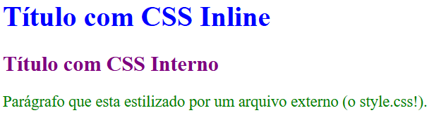

# Aula 02 - CSS

## 1. O que é o CSS? (A "Roupa" do Site)

HTML é o substantivo ("isto é um botão"). CSS é o adjetivo ("este botão é azul e redondo"). A sigla significa **C**ascading **S**tyle **S**heets (Folhas de Estilo em Cascata).

Ele serve para separar o **conteúdo** (o texto da bio) da **aparência** (as cores e fontes). Isso permite que você mude o design do site inteiro mexendo em apenas um arquivo!

### 1.1 A Anatomia de uma Regra

O CSS não é uma linguagem de programação lógica (com `if/else`), é uma linguagem de **regras**. Você aponta para alguém e dá uma ordem.

A estrutura é sempre esta:

``` CSS
/* SELETOR       PROPRIEDADE    VALOR  */
    h1        {   color:         red;   }
```

1. **Seletor (Quem?):** É o alvo. Pode ser uma tag (`p`), uma classe (`.botao`) ou um ID (`#topo`).
    
2. **Propriedade (O quê?):** O que você quer mudar nele? (Cor? Tamanho? Margem?).
    
3. **Valor (Como?):** Qual é a nova aparência? (Vermelho? 20px? Grande?).
    
4. **Ponto e Vírgula (`;`):** É o ponto final da frase. **Essencial!** Sem ele, o CSS não entende onde acaba uma ordem e começa a outra.
    

### 1.2 Por que "Cascata"? (A Lei do Mais Forte)

Imagine uma cachoeira. A água que cai por último cobre a que caiu antes. No CSS, a ordem de leitura é de **cima para baixo**.

Se você escrever isso:

``` css
p { color: blue; } /* O navegador pinta de azul */
p { color: red; }  /* O navegador lê a nova ordem e pinta de vermelho */
```

O parágrafo será **Vermelho**.

- **Regra de Ouro:** Se houver duas regras iguais competindo, a última que o navegador ler ganha. (Existem exceções chamadas "Especificidade", que veremos depois, mas por enquanto confie na ordem!).
    
### 1.3 Onde o CSS mora? (3 Formas de usar)

Você pode escrever CSS em três lugares, mas só um é o ideal para grandes projetos.

1. **Inline (Na linha):** Você escreve o estilo direto na tag HTML, usando o atributo `style`.
    
    - _Como funciona:_
        
        ``` html
        <h1 style="color: blue; font-size: 50px;">Título</h1>
        ```
        
    - _Por que evitar:_ Imagine que seu site tem **50 botões**. Se você usar CSS Inline, terá que copiar e colar esse código 50 vezes. Se um dia quiser mudar a cor de azul para vermelho, terá que editar os 50 botões, um por um. É um pesadelo de manutenção!
        
2. **Interno (No cabeçalho):** Você escreve o CSS dentro do próprio arquivo HTML, mas organizado dentro de uma tag `<style>` que fica no `<head>`.
    
    - _Como funciona:_
        
        ``` html
        <head>
            <style>
                h1 { color: purple; }
            </style>
        </head>
        ```
        
    - _Quando usar:_ É ótimo para testes rápidos, e-mails marketing ou páginas únicas onde não vale a pena criar um arquivo extra.
        
3. **Externo (Arquivo .css):** Você cria um arquivo separado (ex: `style.css`) e o conecta ao HTML. É assim que o Instagram, Google e Facebook são feitos.
    
    - _Passo 1 (Criar o arquivo):_ Crie um arquivo `style.css` e coloque apenas o CSS nele:
        
        ``` css
        /* Arquivo: style.css */
        body { background-color: #f0f0f0; }
        h1 { color: green; }
        ```
        
    - _Passo 2 (Conectar):_ No seu HTML, dentro do `<head>`, use a tag mágica `<link>`:
        
        ``` html
        <head>
            <link rel="stylesheet" href="style.css">
        </head>
        ```
        
    - _A Grande Vantagem:_ Esse único arquivo `style.css` pode controlar **todas** as páginas do seu site. Se você mudar a cor do fundo nele, 100 páginas mudam de cor instantaneamente. Isso é escala!
  
- Exemplo Geral:
    No arquivo .html:
 ``` HTML
   <!DOCTYPE html>
<html>
<head>
    <style>
        /* CSS INTERNO */
        h2 {
            color: purple;
        }
    </style>
    <link rel="stylesheet" href="style.css">
</head>
<body>

    <!-- CSS INLINE -->
    <h1 style="color: blue;">Título com CSS Inline</h1>

    <!-- CSS INTERNO -->
    <h2>Título com CSS Interno</h2>

    <!-- CSS EXTERNO -->
    <p class="externo">
        Parágrafo que sera estilizado por um arquivo externo (o style.css!).
    </p>

</body>
</html>
```

No arquivo style.css:
``` css
/* CSS EXTERNO */
.externo {
    color: green;
    font-size: 18px;
}
```
Resultado:



## 2. Box Model (O Modelo de Caixa)

Aqui está o segredo que separa os amadores dos profissionais: **Na web, tudo é uma caixa retangular.**

Mesmo que você desenhe um círculo (`border-radius: 50%`) ou apenas uma letra "A", para o navegador, aquilo ocupa um espaço quadrado.

### 2.1 As 4 Camadas da Caixa (Analogia do Quadro)

Vamos imaginar que cada elemento do seu site é um **Quadro valioso pendurado numa parede**:

1. **Content (Conteúdo):** É a **FOTO** dentro do quadro.
    
    - Onde está o texto, a imagem ou o ícone real.
        
    - Tamanho definido por `width` (largura) e `height` (altura).
        
2. **Padding (Preenchimento):** É o **PASPATUR** (aquela borda de papelão branca que protege a foto dentro da moldura).
    
    - Ele cria um "respiro" **interno**.
        
    - **Detalhe importante:** Se o quadro tiver fundo colorido, o padding também ganha essa cor.
        
3. **Border (Borda):** É a **MOLDURA** de madeira.
    
    - Fica ao redor do paspatur (padding). É a parte tangível que delimita o elemento.
        
4. **Margin (Margem):** É o **ESPAÇO NA PAREDE** entre este quadro e o quadro vizinho.
    
    - Ele cria um distanciamento **externo**.
        
    - A margem é sempre transparente (invisível), ela só serve para empurrar as coisas para longe.
        

### 2.2 Padding vs Margin: O Duelo Final

A dúvida clássica: _"Quero dar espaço, uso qual?"_

| **Característica** | **Padding (Interno)**                         | **Margin (Externo)**               |
| ------------------ | --------------------------------------------- | ---------------------------------- |
| **Direção**        | Empurra o conteúdo para **dentro**.           | Empurra os vizinhos para **fora**. |
| **Cor de Fundo**   | Pega a cor do background do elemento.         | Sempre transparente.               |
| **Clique**         | Faz parte da área clicável (bom para botões). | Não é clicável (é espaço vazio).   |
| **Quando usar?**   | "Quero o texto longe da borda."               | "Quero o botão longe do texto."    |

> **Exemplo Visual:**
> 
> Pense num botão pequeno.
> 
> - Se você aumentar o **Padding**, o botão fica "gordo" e maior (mais fácil de clicar no celular).
>     
> - Se você aumentar a **Margin**, o botão continua pequeno, mas ninguém chega perto dele (fica isolado).
>     

### 2.3 O Resumo da Matemática (`box-sizing`)

Por padrão, o CSS faz uma conta estranha. Se você diz que uma caixa tem `width: 100px` e adiciona `padding: 20px`, a caixa final fica com **140px** (100 de largura + 20 de esquerda + 20 de direita). Isso quebra layouts!

Para corrigir isso, usamos um "código mágico" no início de todo CSS profissional:


``` css
* {
    box-sizing: border-box;
}
```

Isso diz ao navegador: _"Se eu falei que a largura é 100px, quero que o tamanho total final seja 100px. Se vira ae para ajustar o padding dentro disso!"_


## 3. Seletores: Quem eu estou estilizando?

No CSS, você precisa "apontar" para o elemento que quer maquiar. Existem várias formas de apontar, umas mais fracas e outras mais fortes. Vamos conhecer as principais:

### 3.1 Seletor de Tag 
Ele aponta para **todos** os elementos daquele tipo na página. É como gritar "Alunos!" numa sala de aula: todo mundo olha.

- **Sintaxe:** Apenas o nome da tag.
    
    
    ``` css
    p {
        color: gray;
    }
    ```
    
- **Efeito:** _Todos_ os parágrafos do seu site ficarão cinzas.
    
- **Quando usar:** Para definir padrões globais (ex: mudar a fonte padrão de todos os textos).
    

### 3.2 Seletor de ID 

Ele aponta para **um único** elemento específico. O ID é único: não podem existir dois elementos com o mesmo ID na mesma página.

- **Sintaxe no HTML:** `id="logo-principal"`
    
- **Sintaxe no CSS:** Usa-se a **cerquilha/hashtag (#)**.
    
    ``` css
    #logo-principal {
        width: 200px;
    }
    ```
    
- **Cuidado:** Evite usar IDs para estilizar (CSS). Como eles são únicos, você não consegue reaproveitar o código. Deixe os IDs para o JavaScript ou âncoras de link.
    

### 3.3 Seletor de Classe 

Este é o campeão. Classes funcionam como "crachás" ou "uniformes". Você pode dar o mesmo crachá para vários elementos diferentes.

- **Sintaxe no HTML:** `class="btn-padrao"`
    
- **Sintaxe no CSS:** Usa-se o **ponto (.)**.
    
    ``` css
    .btn-padrao {
        background-color: blue;
        color: white;
        padding: 10px;
    }
    ```
    
- **Poder Especial:** Um elemento pode ter várias classes! `<button class="btn-padrao btn-sucesso">Salvar</button>` _(Ele pega o estilo das duas classes ao mesmo tempo)._
    

---

### 3.4 Outros Seletores Úteis (O Pulo do Gato)

Você não precisa decorar tudo, mas esses três vão salvar sua vida:

#### A. O Seletor Universal (`*`)

Seleciona **TUDO** o que existe na página. Geralmente usado no topo do arquivo para "zerar" margens que os navegadores colocam sozinhos.


``` css
* {
    margin: 0;
    padding: 0;
    box-sizing: border-box; /* Lembra da caixa da aula passada? */
}
```

#### B. Agrupamento (A Vírgula `,`)

Se você quer que o `h1`, o `h2` e o `p` tenham a mesma cor, não precisa repetir o código. Use a vírgula para listar todos.


``` css
h1, h2, p {
    font-family: 'Arial', sans-serif;
    color: #333;
}
```

#### C. Descendência (O Espaço )

E se eu quiser pintar _apenas_ os links que estão dentro do rodapé, e não os do topo? Você usa o "Caminho": **Pai** (espaço) **Filho**.

``` css
footer a {
    color: white; /* Só afeta os links DENTRO do footer */
}
header a {
    color: yellow; /* Só afeta os links DENTRO do header */
}
```

---

### 3.5 Quem ganha a briga? (Especificidade)

Imagine que você tem o seguinte código conflitante. O título será vermelho ou azul?


``` html
<h1 id="titulo" class="texto">Olá</h1>
```

``` css
#titulo { color: red; }  /* ID */
.texto  { color: blue; } /* Classe */
```

**Resposta: Vermelho.** O CSS segue um ranking de força (Especificidade):

1. **Inline** (style direto na tag) - _O mais forte (quase impossível de vencer)._
    
2. **ID** (#) - _Muito forte._
    
3. **Classe** (.) - _Força média (ideal)._
    
4. **Tag** (h1) - _O mais fraco._
    

> **Dica de Ouro:** Sempre tente usar **Classes**. Elas têm força suficiente para funcionar, mas são fáceis de sobrescrever se precisar.


## 4. Tipografia e Google Fonts

Por padrão, os navegadores usam fontes "sem graça" (Times New Roman ou Arial). Vamos mudar isso. Mas antes de importar, você precisa saber o que está escolhendo.

### 4.1 Serif vs Sans-Serif (Com ou Sem "Pézinho"?)

Existem milhares de fontes, mas quase todas caem em duas categorias principais:

1. **Serif (Com Serifa):**
    
    - São aquelas com "pezinhos" ou detalhes nas pontas das letras.
        
    - _Exemplos:_ Times New Roman, Georgia.
        
    - _Vibe:_ Tradicional, séria, elegante. Lembra jornal impresso.
        
2. **Sans-Serif (Sem Serifa):**
    
    - São retas, limpas e geométricas.
        
    - _Exemplos:_ Arial, Roboto, Helvetica.
        
    - _Vibe:_ Moderna, tecnológica, clean. É o padrão da maioria dos apps.
        
3. **Monospace (Monoespaçada):**
    
    - Todas as letras têm a mesma largura (o "i" ocupa o mesmo espaço do "m").
        
    - _Vibe:_ Código de programação, hacker.
        

### 4.2 O Peso da Fonte (Font Weight)

No CSS, nem sempre usamos as palavras `normal` ou `bold`. Usamos **números** para ter mais precisão. Quando você for ao Google Fonts, verá estas opções:

- **300 (Light):** Fininha e elegante.
    
- **400 (Regular):** O tamanho padrão (Normal).
    
- **500 (Medium):** Um pouco mais grossa.
    
- **700 (Bold):** Negrito padrão.
    
- **900 (Black):** Super grossa e pesada.
    

> **Regra:** Se você importar apenas a versão `400` no Google Fonts, não adianta tentar usar `font-weight: 700` no CSS. O navegador vai tentar criar um "negrito falso" que fica feio. **Você precisa importar os pesos que vai usar!**

### 4.3 O Plano de Segurança (Fallbacks)

A internet falha. O Google Fonts pode sair do ar ou a internet do usuário estar lenta. Por isso, no CSS, nós criamos uma "Pilha de Fontes" (Font Stack). É uma lista de prioridades separada por vírgulas.

``` css
body {
    font-family: 'Roboto', 'Arial', sans-serif;
}
```

**Tradução para o Navegador:**

1. _"Tente baixar e usar a **Roboto**."_
    
2. _"Falhou? Ok, veja se o usuário tem **Arial** instalada no computador."_
    
3. _"Não tem? Ok, use **qualquer** fonte sem serifa que você tiver aí."_
    

---

### 4.4 Passo a Passo: Usando o Google Fonts

1. Entre em [fonts.google.com](https://fonts.google.com).
    
2. Pesquise uma fonte (Recomendação: _Poppins_ ou _Inter_).
    
3. Desça a página e vá clicando no **"+"** ao lado dos estilos que você quer (ex: _Regular 400_ e _Bold 700_).
    
4. No canto superior direito, clique no ícone de sacola 🛍️ (View selected families).
    
5. Copie o código da aba **Web** (o bloco cheio de `<link>`).
    
6. Cole no `<head>` do seu HTML (antes do seu CSS).
    
7. Copie a regra CSS (`font-family: ...`) e cole no seu arquivo `.css`.
    

**Exemplo Prático:**

**No HTML:**

``` html
<head>
    <link href="https://fonts.googleapis.com/css2?family=Poppins:wght@400;700&display=swap" rel="stylesheet">
    <link rel="stylesheet" href="style.css">
</head>
```

**No CSS:**

``` css
body {
    /* Aplica em tudo */
    font-family: 'Poppins', sans-serif;
    font-weight: 400;
}

h1 {
    /* Títulos em negrito */
    font-weight: 700;
}
```

## 5. Cores (Hex Codes)

No começo, usamos palavras em inglês (`red`, `blue`, `gold`). O problema é que existem apenas 140 nomes de cores, mas nossos monitores mostram **16 milhões**. Para acessar essas milhões de cores, usamos códigos matemáticos.

### 5.1 O Código Hexadecimal (O Padrão #)

É o formato mais usado na web. Ele sempre começa com uma **hashtag (#)** seguida de 6 dígitos que vão de `0` a `F`.

- **A Lógica:** É uma mistura de tintas digitais (**R**ed, **G**reen, **B**lue).
    
    - Os dois primeiros dígitos são a quantidade de **Vermelho**.
        
    - Os dois do meio são **Verde**.
        
    - Os dois últimos são **Azul**.
        
- **A Escala:**
    
    - `00` = Escuridão total (sem cor).
        
    - `FF` = Luz total (cor máxima).
        

**Exemplos para decorar:**

- `#000000` = Preto (Tudo desligado).
    
- `#FFFFFF` = Branco (Tudo ligado no máximo).
    
- `#FF0000` = Vermelho puro.
    
- `#CCCCCC` = Cinza claro.
    

### 5.2 RGBA (O Poder da Transparência)

E se eu quiser um fundo "vidro fumê", que dá para ver o que está atrás? O Hexadecimal não faz isso. Para isso, usamos a função `rgba()`.

- **R, G, B:** Números de 0 a 255.
    
- **A (Alpha):** É a transparência! Vai de `0` (invisível) a `1` (sólido).
    

``` css
/* Fundo preto com 50% de transparência */
.overlay {
    background-color: rgba(0, 0, 0, 0.5);
}
```

- _Dica:_ Muito usado em menus fixos ou modais (pop-ups).
    

### 5.3 Onde aplicar a cor? (Propriedades)

Cuidado para não confundir **o que** você está pintando.

1. **`color`:** Muda a cor do **TEXTO** (letras, ícones de fonte).
    
    - _Errado:_ `font-color: red;` (Isso não existe!).
        
    - _Certo:_ `color: red;`
        
2. **`background-color`:** Muda a cor do **FUNDO** da caixa.
    
3. **`border-color`:** Muda a cor da **BORDA**.
    

### 5.4 Ferramentas (Como achar a cor perfeita?)

Você não precisa ser um designer para combinar cores.

1. **VS Code Color Picker:**
    
    - Digite qualquer cor (ex: `red`) no seu CSS e coloque o mouse em cima dela.
        
    - Uma caixinha vai abrir. Você pode arrastar a bolinha para escolher a cor que quiser e ele converte para Hex ou RGB automaticamente!
        
2. **Sites de Paletas:**
    
    - **Coolors.co:** Gera paletas que combinam automaticamente.
        
    - **Adobe Color:** Ótimo para achar cores complementares.


## 6. Exemplo de Código: O "Card" Perfeito

Vamos ver na prática como transformar um HTML simples em um componente visual usando o Box Model. Imagine que queremos criar um cartão de produto para uma loja virtual.

### O HTML 

``` html
<div class="card-produto">
    <h2>Tênis de Corrida</h2>
    <p>O melhor tênis para sua maratona.</p>
    <button>Comprar Agora</button>
</div>
```

### O CSS 

Analise os comentários para entender o que cada linha faz:

``` css
.card-produto {
    /* 1. Tamanho e Cor (Content) */
    width: 300px;              /* Largura fixa */
    background-color: #f0f0f0; /* Fundo cinza claro */
    
    /* 2. Respiro Interno (Padding) */
    padding: 20px;             
    /* O texto desgruda da borda. Se tirar isso, fica feio! */

    /* 3. A Moldura (Border) */
    border: 2px solid #333;    /* Borda sólida cinza escuro */
    border-radius: 10px;       /* Arredonda os cantos */

    /* 4. Espaço Externo (Margin) */
    margin: 50px auto;         
    /* 50px em cima/baixo para afastar de outros elementos */
    /* 'auto' nas laterais para CENTRALIZAR na tela */
    
    /* Extra: Fonte */
    font-family: 'Arial', sans-serif;
    text-align: center;        /* Centraliza o texto dentro do card */
}

button {
    background-color: #ff5722;
    color: white;
    padding: 10px 20px;        /* Botão gordinho é melhor de clicar */
    border: none;              /* Remove a borda padrão feia */
    border-radius: 5px;
    margin-top: 15px;          /* Afasta o botão do texto de cima */
    cursor: pointer;           /* Mãozinha ao passar o mouse */
}
```

### O que acontece aqui?

1. **Sem Padding:** O texto "Tênis de Corrida" ficaria colado na linha preta da borda. O `padding: 20px` empurra o conteúdo para o centro.
    
2. **Sem Margin:** O card ficaria colado no canto superior esquerdo da tela. O `margin: 50px auto` empurra o card para o meio da página e para baixo.
    
3. **Botão:** Note que usamos `padding` no botão também! Isso faz ele ficar "gordinho" e clicável, sem aumentar o tamanho da fonte.

## 7. Desafio Prático: Estilizando o Cartão de Bio

Vamos pegar o HTML "feio" da Aula 01 e transformá-lo em um Card profissional centralizado na tela.

**Preparação:**

1. Crie um arquivo `style.css` na mesma pasta do `index.html`.
    
2. Conecte os dois usando a tag `<link>` no HTML.
    

**Missão 1: O Fundo e a Fonte**

- Vá no Google Fonts, escolha uma fonte legal e importe no HTML.
    
- No CSS, selecione o `body`:
    
    - Mude a cor de fundo (`background-color`) para um cinza claro ou uma cor de sua preferência.
        
    - Aplique a fonte que você baixou.
        

**Missão 2: Criando o Card (Box Model na veia)** No HTML, envolva todo o conteúdo (``, `<h1>`, etc) dentro de uma `<main>` ou `<div class="card">`. Agora estilize essa classe `.card`:

- Defina uma largura fixa (`width: 300px`).
    
- **A Mágica da Centralização:** Use `margin: 50px auto;`.
    
    - _Explicação:_ 50px em cima/baixo e "auto" nas laterais (o navegador calcula espaços iguais na esquerda e direita).
        
- Coloque fundo branco.
    
- Adicione `padding: 20px` para o texto não colar na borda.
    
- Arredonde os cantos do cartão com `border-radius: 10px`.
    
- (Opcional) Adicione uma sombra: `box-shadow: 2px 2px 10px rgba(0,0,0,0.1)`.
    

**Missão 3: A Foto Redonda**

- Selecione a imagem (pode criar uma classe `.avatar` para ela).
    
- Defina uma largura menor (ex: `100px`).
    
- Transforme em círculo: `border-radius: 50%`.
    
- Tente centralizar a imagem dentro do card (Dica: imagens são elementos _inline_. Para centralizar, você pode usar `text-align: center` no pai dela, ou transformá-la em `display: block` e usar `margin: auto`).
    

**Resultado Esperado:** Um cartão centralizado na tela, com fundo colorido atrás, tipografia bonita e foto redonda. O primeiro passo para se tornar um Front-end Developer!
