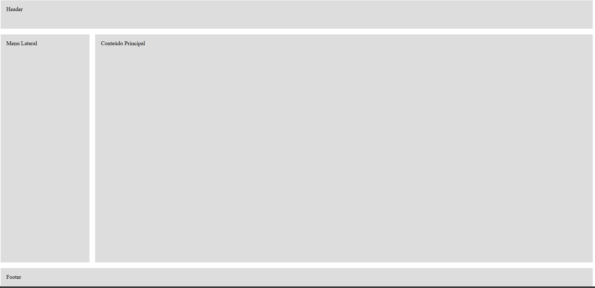

# Aula 03 - Flexbox

## 1. Layout Moderno

### 1.1 O Problema: A "Gravidade" do HTML

Por padrão, o HTML funciona como um documento de texto do Word.

- **Elementos de Bloco** (`<div>`, `<h1>`, `<p>`) têm uma "gravidade" vertical: eles sempre caem para a linha de baixo, um em cima do outro.
    
- **O Desafio:** Como colocar um logotipo na esquerda e um menu na direita? Como colocar 3 fotos lado a lado?
    

Antigamente, usávamos "gambiarras":

- **Tabelas:** Criávamos tabelas invisíveis (sim, igual ao Excel) para diagramar o site. Era horrível para acessibilidade.
    
- **Floats:** Usávamos `float: left` para "flutuar" elementos. Mas isso quebrava o layout constantemente e exigia "hacks" para limpar a sujeira (`clearfix`).
    

**A Boa Notícia:** Esqueça tudo isso. Hoje temos **Flexbox** e **CSS Grid**.

### 1.2 A Regra do Pai e Filho 

Essa é a regra mais importante desta aula. Se você entender isso, você entendeu Flexbox.

No CSS Layout, nós **não** movemos os elementos individualmente. Nós damos ordens ao **Container** (a caixa que segura eles).

Imagine que você tem 3 bonecos (Filhos). Você não empurra os bonecos com a mão. Você mexe a cruz de madeira (Pai) e as cordas movem os bonecos automaticamente.

- **Container (Pai):** É onde você aplica o comando `display: flex` ou `display: grid`.
    
- **Items (Filhos):** São os elementos diretos dentro do pai. Eles apenas obedecem.
    

**Visualizando no Código:**

``` html
<div class="voce-manda-nesta-div">

    <div class="item">1</div>
    <div class="item">2</div>
    <div class="item">3</div>

</div>
```

**O Erro Clássico:** O aluno tenta colocar `display: flex` na classe `.item`. **Não funciona!** O item não controla a si mesmo. Quem controla o alinhamento é o Pai.

Exemplo geral:

```html
<!DOCTYPE html>
<html lang="pt-BR">
<head>
    <meta charset="UTF-8">
    <title>Pai e Filho no Flexbox</title>

    <style>
        body {
            font-family: Arial, sans-serif;
        }

        /* ERRADO: Flex no filho (não funciona) */
        .item-errado {
            display: flex;
            justify-content: center;
            background-color: #ffcccc;
        }

        /* CERTO: Flex no pai (funciona) */
        .container-certo {
            display: flex;              /* O PAI manda */
            justify-content: center;    /* Centraliza os FILHOS */
            gap: 10px;
            background-color: #e6f2ff;
            padding: 20px;
        }

        .item {
            background-color: #4da6ff;
            color: white;
            padding: 20px;
            width: 50px;
            text-align: center;
            font-weight: bold;
        }

        .box {
            border: 2px dashed #999;
            margin-bottom: 30px;
            padding: 10px;
        }
    </style>
</head>
<body>

    <h2>Flexbox: Quem manda é o Pai</h2>

    <h3> Errado: Tentando alinhar no Filho</h3>
    <div class="box">
        <div class="item item-errado">1</div>
        <div class="item item-errado">2</div>
        <div class="item item-errado">3</div>
    </div>

    <p>
        Cada item virou flex de si mesmo,  
        mas eles NÃO se alinharam entre si.
    </p>

    <hr>

    <h3> Certo: Alinhando no Pai</h3>
    <div class="box container-certo">
        <div class="item">1</div>
        <div class="item">2</div>
        <div class="item">3</div>
    </div>

    <p>
        Agora sim! O PAI controla o alinhamento dos FILHOS.
    </p>

</body>
</html>
```

Resultado:


## 2. Flexbox: O Colar de Pérolas (1 Dimensão)

Imagine um colar de pérolas. Você só pode organizar as pérolas em uma linha. Você pode empurrá-las para a esquerda, para a direita ou espalhá-las, mas elas sempre seguem um **único fluxo**.

### 2.1 Ativando o Modo Flex

Para começar, você precisa selecionar o **Container (Pai)** e dar a ordem:

``` css
.pai {
    display: flex;
}
```

**O que acontece imediatamente?**

1. Os filhos, que antes estavam um embaixo do outro (bloco), agora ficam **um ao lado do outro** (linha).
    
2. Eles tentam se espremer para caber na mesma linha.
    
3. Eles esticam a altura para preencher o pai (padrão `stretch`).
    

### 2.2 O Volante: `flex-direction` (Linha ou Coluna?)

Você decide para onde o fluxo vai.

- **`row` (Padrão):** O eixo é **Horizontal** (→). Os itens ficam lado a lado.
    
- **`column`:** O eixo vira **Vertical** (↓). Os itens ficam empilhados (igual ao comportamento normal de `div`, mas com os poderes de alinhamento do Flex).
    
    - _Dica:_ Usaremos muito `flex-direction: column` para layouts de celular!
        

---

### 2.3 Eixo Principal (`justify-content`)

Imagine que você está organizando livros em uma prateleira horizontal. Como você quer distribuir o espaço que sobra?

- **`flex-start` (Padrão):** Tudo no começo (esquerda).
    
- **`center`:** Tudo no meio da prateleira.
    
- **`flex-end`:** Tudo no final (direita).
    
- **Os Espaçamentos Mágicos (Essenciais para Menus):**
    
    - **`space-between`:** O primeiro cola na esquerda, o último na direita, e o resto se divide igualmente. _(Perfeito para: Logo na esquerda, Login na direita)._
        
    - **`space-around`:** Cria um espaço igual _ao redor_ de cada item. (O visual fica parecendo margens iguais).
        
    - **`space-evenly`:** O espaço _entre_ os itens e as bordas é matematicamente idêntico.
        

### 2.4 Eixo Transversal (`align-items`)

Agora, imagine o alinhamento vertical (altura). Como os itens se comportam em relação ao teto e ao chão do pai?

- **`stretch` (Padrão):** Se você não definir altura nos filhos, eles esticam para ocupar 100% da altura do pai.
    
- **`center`:** O famoso "Centralizar Verticalmente". Os itens ficam no meio da altura.
    
- **`flex-start`:** Colados no teto.
    
- **`flex-end`:** Colados no chão.
    
 **O "Cheat Code" da Centralização Perfeita:** Quer centralizar algo exatamente no meio da tela (horizontal e vertical)?
 
 ``` css
.pai {
	display: flex;
    justify-content: center; /* Meio Horizontal */
    align-items: center;     /* Meio Vertical */
    height: 100vh;           /* Altura da tela toda */
 }
 ```

---

Sei como tudo isso pode parecer ser muita coisa e complicado de se entender de primeira kkkkk, caso tenha restado alguma dúvida, espero que essa imagem possa ajudar um pouco a esclarecer a diferenças de cada um:


### 2.5 O Espaçamento Moderno (`gap`)

Antigamente, usávamos `margin-right` no item para separar um do outro. Isso causava problemas (o último item ficava com margem sobrando). Hoje, usamos `gap` no **Pai**.

``` CSS
.pai {
    display: flex;
    gap: 20px; /* Cria um corredor de 20px entre cada filho */
}
```

Exemplo geral:

- No .html:
``` html
  <!DOCTYPE html>
<html lang="pt-BR">
<head>
  <meta charset="UTF-8">
  <title>Header com Flexbox</title>

  <link rel="stylesheet" href="style.css">
</head>
<body>

  <header class="topo">
    <div class="logo">LOGO</div>

    <nav class="menu">
      <a href="#">Home</a>
      <a href="#">Sobre</a>
      <a href="#">Contato</a>
    </nav>

    <button class="login">Login</button>
  </header>

</body>
</html>
  ```
- No style.css:
``` css
  .topo {
  display: flex;
  justify-content: space-between; /* espalha esquerda ↔ direita */
  align-items: center;            /* centraliza verticalmente */
  padding: 16px 32px;
  background: #222;
  color: white;
}

.menu {
  display: flex;
  gap: 20px; /* espaço entre os links */
}

.logo {
  font-weight: bold;
  font-size: 20px;
}

.login {
  padding: 8px 16px;
}
  ```


## 3. CSS Grid: O Arquiteto (2 Dimensões)

Enquanto o Flexbox é ótimo para alinhar botões ou itens em uma lista (1D), o Grid foi feito para diagramar **páginas inteiras** (2D). Ele transforma o seu container em um tabuleiro de xadrez onde você controla onde cada peça começa e onde termina.

### 3.1 Criando a Grade (Colunas e Linhas)

Tudo começa no **Container (Pai)**.


``` css
.tabuleiro {
    display: grid;
    /* Define as colunas (Vertical) */
    grid-template-columns: 200px 1fr 1fr;
    /* Define as linhas (Horizontal) */
    grid-template-rows: 100px auto;
}
```

**O que isso criou?**

- **Colunas:**
    
    1. Uma fixa de `200px` (ex: Menu Lateral).
        
    2. Duas flexíveis (`1fr` cada) que dividem o resto do espaço.
        
- **Linhas:**
    
    1. Uma fixa de `100px` (ex: Cabeçalho).
        
    2. Uma automática (`auto`) que cresce dependendo do tamanho do texto.
        

### 3.2 A Unidade `fr` (Fraction)

Esqueça porcentagens (`33.33%`). O Grid trouxe a unidade `fr` (fração do espaço livre).

Ela é inteligente: ela calcula o espaço que sobrou **depois** de descontar margens, gaps e tamanhos fixos.

- `1fr 1fr 1fr` = Três colunas iguais.
    
- `2fr 1fr` = A primeira coluna é o **dobro** da largura da segunda.
    

### 3.3 A Função `repeat()` (Código Limpo)

Ninguém merece escrever `1fr` doze vezes kkkkkk, então para facilitar, usamos a função repeat():

- **Antes:** `grid-template-columns: 1fr 1fr 1fr 1fr;`
    
- **Depois:** `grid-template-columns: repeat(4, 1fr);`
    

### 3.4 Posicionando Itens (Linhas e Spans)

Aqui é onde o Grid brilha. Você não precisa colocar os elementos na ordem do HTML. Você pode dizer: _"Item 1, ocupe da linha 1 até a 3"_.

Imagine que a grade tem linhas desenhadas (como num caderno). Se temos 3 colunas, temos **4 linhas verticais** (a borda inicial, as duas do meio e a borda final).

**Usando `grid-column` e `grid-row` nos FILHOS:**

1. **Start / End (Coordenadas):**
    
    ``` css
    .item-grande {
        /* Começa na linha vertical 1 e vai até a 3 */
        grid-column: 1 / 3;
    }
    ```
    
2. **Span (Esticar - Mais Fácil):**
    
    Em vez de contar linhas, você diz _quantas células_ quer ocupar.
    
    
    ``` css
    .banner {
        /* "Onde eu estiver, estique por 3 colunas" */
        grid-column: span 3;
    }
    .sidebar {
        /* "Estique por 2 linhas para baixo" */
        grid-row: span 2;
    }
    ```
    

### 3.5 Grid Template Areas (O "Mapa Visual")

Essa é a técnica mais avançada e intuitiva. Você dá nomes aos bois e desenha o site no CSS como se fosse arte ASCII.

1. **Dê nomes aos filhos:**
    
    
    ``` css
    .header { grid-area: cabecalho; }
    .menu   { grid-area: lateral; }
    .main   { grid-area: conteudo; }
    .footer { grid-area: rodape; }
    ```
    
2. **Desenhe no Pai:**
    
    ``` css
    .site-container {
        display: grid;
        grid-template-areas:
            "cabecalho cabecalho"
            "lateral   conteudo"
            "rodape    rodape";
    }
    ```
    
    _O CSS entende que o cabeçalho deve ocupar as duas colunas do topo, e a lateral deve ficar ao lado do conteúdo._
    

---

### Resumo: Quando usar o quê?

|**Recurso**|**O que faz?**|**Exemplo de Uso**|
|---|---|---|
|**`fr`**|Divide o espaço proporcionalmente.|Colunas de texto fluídas.|
|**`repeat()`**|Cria padrões repetitivos.|Galerias de fotos (ex: Instagram).|
|**`gap`**|Espaço entre as células (calhas).|Separar fotos sem usar margin.|
|**`span`**|Faz um item ocupar várias casas.|Um post de destaque no blog.|
|**Areas**|Nomeia regiões do layout.|Estrutura macro do site (Layout).|

Exemplo geral:

- No .html:
``` html

  <!DOCTYPE html>
<html lang="pt-BR">
<head>
  <meta charset="UTF-8">
  <title>Exemplo Grid Layout</title>


  <link rel="stylesheet" href="style.css">
</head>
<body>

  <div class="site">
    <header class="header">Header</header>
    <aside class="sidebar">Menu Lateral</aside>
    <main class="main">Conteúdo Principal</main>
    <footer class="footer">Footer</footer>
  </div>

</body>
</html>
```

- No style.css:

``` css
  .site {
  display: grid;

  grid-template-columns: 250px 1fr;
  grid-template-rows: 80px 1fr 60px;

  grid-template-areas:
    "header  header"
    "sidebar main"
    "footer  footer";

  height: 100vh;
  gap: 16px;
}

/* Ligando cada área */
.header  { grid-area: header; }
.sidebar { grid-area: sidebar; }
.main    { grid-area: main; }
.footer  { grid-area: footer; }

/* Só pra visualizar melhor */
.header, .sidebar, .main, .footer {
  background: #ddd;
  padding: 16px;
  font-family: Arial, sans-serif;
}
  ```



## 4. Batalha: Flexbox vs Grid (Quem ganha?)

A resposta curta é: **Ninguém ganha.** Eles não são inimigos, são parceiros.

Mas cada um tem uma especialidade. Usar Grid para alinhar um ícone dentro de um botão é "matar formiga com canhão". Usar Flexbox para diagramar um site inteiro é "tentar construir um prédio com fita adesiva".

### 4.1 A Diferença de Dimensão (1D vs 2D)

- **Flexbox (1D - Uma Dimensão):**
    
    Ele funciona em **uma direção** por vez. Ou é uma Linha, ou é uma Coluna.
    
    - _Pense em:_ Uma fila de banco, um colar de pérolas, itens de um menu.
        
    - _O foco:_ "Empurrar" os itens para caberem na linha.
        
- **Grid (2D - Duas Dimensões):**
    
    Ele funciona em **duas direções** simultaneamente (Linhas E Colunas).
    
    - _Pense em:_ Um tabuleiro de xadrez, uma planilha do Excel, a planta baixa de uma casa.
        
    - _O foco:_ "Criar células" onde os itens vão morar.
        

### 4.2 A Estratégia: Conteúdo vs Layout

Essa é a diferença técnica mais importante:

1. **Flexbox é "Content-First" (O conteúdo manda):**
    
    Você usa quando o tamanho dos itens deve definir o tamanho do layout.
    
    - _Ex:_ "Quero que este botão tenha a largura do texto 'Enviar' + 20px de padding."
        
    - _Comportamento:_ Se você adicionar mais texto, o Flexbox empurra os vizinhos para dar espaço.
        
2. **Grid é "Layout-First" (A grade manda):**
    
    Você usa quando o layout deve definir o tamanho dos itens.
    
    - _Ex:_ "Quero 3 colunas iguais. Não me importa o que tem dentro, elas TÊM que ser iguais."
        
    - _Comportamento:_ Se você colocar uma imagem gigante, o Grid vai forçar (ou cortar) a imagem para caber na célula que você desenhou.
        

### 4.3 O Guia de Decisão (Cheat Sheet)

| **Cenário**             | **O Melhor Candidato** | **Por quê?**                                                                              |
| ----------------------- | ---------------------- | ----------------------------------------------------------------------------------------- |
| **Menu de Navegação**   | **Flexbox**            | Alinhar Logo na esquerda e Links na direita (`justify-content: space-between`) é trivial. |
| **Estrutura da Página** | **Grid**               | Definir Cabeçalho, Lateral, Principal e Rodapé é muito mais limpo com Grid Areas.         |
| **Galeria de Fotos**    | **Grid**               | Criar grades responsivas (`repeat(auto-fit)`) e alinhar fotos de tamanhos variados.       |
| **Centralizar uma Div** | **Flexbox**            | `display: flex; justify-center; align-center`. Simples e rápido.                          |
| **Formulário**          | **Ambos**              | Grid para o layout geral (Labels x Inputs), Flexbox para alinhar o ícone dentro do input. |
| **Cards de Produto**    | **Flexbox**            | Se for uma lista linear (carrossel). Se for grade fixa, Grid.                             |

### 4.4 A Combinação Perfeita (Aninhamento)

O segredo dos profissionais é misturar os dois.

**Imagine um site completo:**

1. O **Grid** define a estrutura macro da casa (Onde fica o quarto, a sala, a cozinha).
    
2. O **Flexbox** arruma a mobília dentro de cada cômodo (O sofá fica ao lado da mesa).
    

Exemplo de Código:

``` css
/* O Site (Macro) */
.site {
    display: grid; /* Define as áreas principais */
    grid-template-areas: "header header" "sidebar content";
}

/* O Cabeçalho (Micro) */
.header {
    display: flex; /* Alinha o logo e o menu */
    justify-content: space-between;
}
```

Exemplo mais geral:
- No .html:
``` html
<!DOCTYPE html>
<html lang="pt-BR">
<head>
  <meta charset="UTF-8">
  <title>Grid + Flexbox</title>

  <link rel="stylesheet" href="style.css">
</head>
<body>

  <div class="site">

    <!-- HEADER (Flexbox) -->
    <header class="header">
      <div class="logo">LOGO</div>

      <nav class="menu">
        <a href="#">Home</a>
        <a href="#">Sobre</a>
        <a href="#">Contato</a>
      </nav>
    </header>

    <!-- SIDEBAR (Flexbox) -->
    <aside class="sidebar">
      <a href="#">Dashboard</a>
      <a href="#">Perfil</a>
      <a href="#">Configurações</a>
    </aside>

    <!-- CONTEÚDO PRINCIPAL -->
    <main class="content">
      <h1>Dashboard</h1>

      <!-- Cards (Flexbox) -->
      <div class="cards">
        <div class="card">Vendas</div>
        <div class="card">Usuários</div>
        <div class="card">Relatórios</div>
      </div>
    </main>

  </div>

</body>
</html>

```
- No style.css:

``` css
* {
  box-sizing: border-box;
  margin: 0;
  padding: 0;
}

/* ===== GRID = ESTRUTURA DO SITE (MACRO) ===== */
.site {
  display: grid;
  grid-template-areas:
    "header header"
    "sidebar content";

  grid-template-columns: 200px 1fr;
  grid-template-rows: 60px 1fr;

  min-height: 100vh;
}

/* Áreas do Grid */
.header  { grid-area: header; }
.sidebar { grid-area: sidebar; }
.content { grid-area: content; }

/* ===== FLEXBOX = ARRUMAÇÃO INTERNA (MICRO) ===== */

/* Header */
.header {
  display: flex;
  justify-content: space-between;
  align-items: center;

  padding: 0 24px;
  background-color: #1f2933;
  color: white;
}

.menu {
  display: flex;
  gap: 16px;
}

/* Sidebar */
.sidebar {
  display: flex;
  flex-direction: column;
  gap: 12px;

  padding: 16px;
  background-color: #f3f4f6;
}

/* Conteúdo */
.content {
  padding: 24px;
}

/* Cards */
.cards {
  display: flex;
  gap: 16px;
  margin-top: 16px;
}

.card {
  flex: 1;
  padding: 24px;
  background-color: #e5e7eb;
  border-radius: 8px;
  text-align: center;
}
```
Resultado:


## 5. Responsividade: O Site Camaleão (Media Queries)

Você fez um site lindo no seu monitor gigante. Mas quando abre no celular, o texto fica minúsculo e o menu quebra. A solução chama-se **Media Queries**.

### 5.1 O que é? (A Lógica do `if`)

Imagine que o CSS é um conjunto de regras de roupas.

- **Regra Padrão:** "Use camiseta."
    
- **Media Query (Condição):** "**SE** estiver chovendo, coloque uma jaqueta por cima."
    

No CSS, a "chuva" é o **tamanho da tela**.

``` css
/* Regra Padrão (Desktop) */
body {
    background-color: blue;
}

/* Regra Condicional (Só aplica SE a tela for menor que 768px) */
@media (max-width: 768px) {
    body {
        background-color: red; /* Sobrescreve o azul */
    }
}
```

### 5.2 Anatomia do Comando

Vamos dissecar a linha `@media (max-width: 768px)`:

1. `@media`: "Atenção navegador, aqui vem uma regra especial."
    
2. `(max-width: 768px)`: A condição. Significa **"Até no MÁXIMO 768 pixels de largura"**.
    
    - Ou seja: De 0px até 768px, essa regra vale.
        
    - De 769px para cima, ela é ignorada.
        

### 5.3 Breakpoints (Guias, não Regras)

Não existem números mágicos oficiais. Esses valores são **guias comuns** usados como ponto de partida.  O mais importante é criar breakpoints quando o **layout precisar**, não baseado apenas no tipo de dispositivo.

- **Celulares (Pequenos):** `max-width: 480px`
    
- **Tablets / Celulares Grandes:** `max-width: 768px` 
    
- **Laptops Pequenos:** `max-width: 1024px`
    
- **Monitores Grandes:** `min-width: 1200px`
    

### 5.4 Desktop-First vs Mobile-First

Existem duas formas de pensar o CSS:

1. **Desktop-First (O que estamos fazendo):**
    
    - Você cria o site pensando no computador.
        
    - Depois, cria Media Queries (`max-width`) para **consertar** o que quebrou no celular.
        
    - _Vantagem:_ Mais intuitivo para iniciantes.
        
2. **Mobile-First (O ideal profissional):**
    
    - Você cria o site pensando no celular (telas pequenas) primeiro.
        
    - Depois, cria Media Queries (`min-width`) para **expandir** o layout quando a tela cresce.
        
    - _Vantagem:_ O código fica mais leve e o site carrega mais rápido no 4G.
        

### 5.5 Como testar sem ter 10 celulares? (F12)

Você não precisa comprar um iPhone e um Android para testar.

1. Abra seu site no Chrome.
    
2. Aperte **F12** (ou clique com botão direito > Inspecionar).
    
3. Clique no ícone de **Celular/Tablet** (canto superior esquerdo do painel que abriu) ou use `Ctrl + Shift + M`.
    
4. Pronto! Agora você pode simular iPhone, iPad, Galaxy S20 direto no seu monitor.

---

## 6. Desafio: Galeria de Cards Responsiva

Agora é sua vez de juntar tudo o que aprendeu.

**O Objetivo:** Criar uma seção de "Nossos Produtos" com 3 cards.

1. **Estrutura (HTML):**
    
    - Crie um container pai.
        
    - Crie 3 filhos (cards). Cada card deve ter uma foto, um título e um preço.
        
2. **Estilo Desktop (CSS):**
    
    - Use **Flexbox** ou **Grid** para deixar os 3 cards **um ao lado do outro** (alinhados horizontalmente).
        
    - Use `gap` para separá-los.
        
3. **Responsividade (Mobile):**
    
    - Crie uma `@media query` para telas menores que `768px`.
        
    - Nessa versão, os cards devem ficar **um embaixo do outro** (pilha vertical).
        

> **Dica para o Flexbox:** Existe uma propriedade chamada `flex-direction: column;` que muda o eixo de horizontal para vertical. **Dica para o Grid:** Basta mudar as colunas para `1fr` (uma única coluna).
